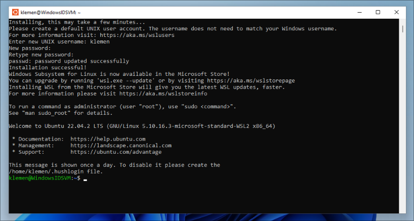

# Setting up your environment

The main goal of these instructions is to help you prepare the environment for the course (and the rest of your studies) that will be able to handle (almost) anything the course throws at you.

For now, don't worry if you don't recognize all of the tools, just install them and we will cover them eventually at IDS labs as well as tutoring hours.

You need the following software:

- git and Github CLI
- conda
- docker and docker-compose
- Google Chrome (I know not everyone uses Chrome, but the dev tools it provides are the industry standard and it will be easier to deal with web scraping if everyone has the same tooling)
- something to write your code in (an IDE, see [FAQ](#what-do-i-write-my-code-inwhich-ide-do-i-use)).
- something to write your reports in (a LaTeX editor, see [FAQ](#what-do-i-use-for-writing-reports)).

## Install software

<details>
    <summary>Windows</summary>

Just Windows can be quite clunky for development, thankfully, Microsoft knows this and they have developed an awesome tool called the Windows Subsystem for Linux (WSL) which enables you to run a Linux system just like you would any other app and then you have most of the benefits that Linux provides with very little complexity. Therefore, we will install WSL and Docker Desktop on Windows first, and then everything else will be installed inside WSL.

**Install WSL2**

Go to Start, search and run `Turn Windows features on or off`. In the dialog that pops up, make sure that the box for `Hyper-V` is checked. After that, click Ok, let it install and click `Restart now` to reboot the computer.

Go to Start, search for `powershell`, **right click Windows PowerShell and open it as an administrator**. Run the below command (it may take a while).

```powershell
wsl --install
```

**Now restart the computer!**

On login a window should open where Ubuntu is being installed. Just follow the on screen prompts (enter a username and choose a password). If it doesn't, go to start and search for `Ubuntu` and run it.

If everything works you should see something like this:


This is now a fully-functioning Linux installation that you can access anytime by searching for `Ubuntu` in Start. From now on, you use this for executing all commands, treat it as a completely separate system from your Windows (although, it technically isn't).

**From now on, anytime you need to do anything in the terminal you use the Ubuntu app!**

**Install Docker Desktop**

Get [Docker Desktop](https://www.docker.com/products/docker-desktop/) and install it. **Make sure that `use WSL2 instead of Hyper-V` is checked**. Once done, **restart the computer.**

**Installing other prerequisites inside WSL**

Now that we have a linux terminal, you can paste and run the commands below into the Ubuntu app.

```bash
# Git
sudo apt update
sudo apt install git -y

# Github CLI
type -p curl >/dev/null || (sudo apt update && sudo apt install curl -y)
curl -fsSL https://cli.github.com/packages/githubcli-archive-keyring.gpg | sudo dd of=/usr/share/keyrings/githubcli-archive-keyring.gpg \
&& sudo chmod go+r /usr/share/keyrings/githubcli-archive-keyring.gpg \
&& echo "deb [arch=$(dpkg --print-architecture) signed-by=/usr/share/keyrings/githubcli-archive-keyring.gpg] https://cli.github.com/packages stable main" | sudo tee /etc/apt/sources.list.d/github-cli.list > /dev/null \
&& sudo apt update \
&& sudo apt install gh -y

# Conda
mkdir -p ~/miniconda3
wget https://repo.anaconda.com/miniconda/Miniconda3-latest-Linux-x86_64.sh -O ~/miniconda3/miniconda.sh
bash ~/miniconda3/miniconda.sh -b -u -p ~/miniconda3
rm -rf ~/miniconda3/miniconda.sh
~/miniconda3/bin/conda init bash
~/miniconda3/bin/conda init zsh
```

**Close the Ubuntu app and open it again**.

</details>

<details>
    <summary>macOS</summary>

Check to see if you have git, if not it should prompt you to install it

```bash
git --version
```

**Install homebrew**

To install everything we will use the [Homebrew](https://brew.sh/) package manager which is a very useful tool all around on macOS (similar to apt on Ubuntu). Install it if you don't have it with:

```bash
/bin/bash -c "$(curl -fsSL https://raw.githubusercontent.com/Homebrew/install/HEAD/install.sh)"
```

**Install software**

```bash
brew install gh
brew install --cask miniconda
/usr/local/bin/conda init zsh
brew install --cask docker
```

Before using Docker in the terminal, you have to launch the Docker app, it will ask you to agree to some terms. After agreeing, select to use the recommended settings and enter your password when prompted. Then it will ask you to sign in with your docker hub account, choose to continue without signing in.

Remember, to use Docker, it needs to be running in the background (look for the whale in the top-right of your screen), if it isn't start it by running the Docker app.

</details>

<details>
    <summary>Linux</summary>
The below instructions are for Ubuntu/Debian-based linux distributions. If you use anything else contact me should you require assistance.

_Note: some of the tools (like git) are very likely already installed, don't worry, the command will skip them._

_Note: yes it is very dangerous to copy commands starting with sudo from some random guy on the internet, but just trust me ;)._

Copy and paste everything below into a terminal and hit ENTER.

```bash
# Git
sudo apt update
sudo apt install git -y

# Github CLI
type -p curl >/dev/null || (sudo apt update && sudo apt install curl -y)
curl -fsSL https://cli.github.com/packages/githubcli-archive-keyring.gpg | sudo dd of=/usr/share/keyrings/githubcli-archive-keyring.gpg \
&& sudo chmod go+r /usr/share/keyrings/githubcli-archive-keyring.gpg \
&& echo "deb [arch=$(dpkg --print-architecture) signed-by=/usr/share/keyrings/githubcli-archive-keyring.gpg] https://cli.github.com/packages stable main" | sudo tee /etc/apt/sources.list.d/github-cli.list > /dev/null \
&& sudo apt update \
&& sudo apt install gh -y

# Conda
mkdir -p ~/miniconda3
wget https://repo.anaconda.com/miniconda/Miniconda3-latest-Linux-x86_64.sh -O ~/miniconda3/miniconda.sh
bash ~/miniconda3/miniconda.sh -b -u -p ~/miniconda3
rm -rf ~/miniconda3/miniconda.sh
~/miniconda3/bin/conda init bash
~/miniconda3/bin/conda init zsh

# Docker
sudo apt install apt-transport-https ca-certificates curl software-properties-common -y
curl -fsSL https://download.docker.com/linux/ubuntu/gpg | sudo gpg --dearmor -o /usr/share/keyrings/docker-archive-keyring.gpg
echo "deb [arch=$(dpkg --print-architecture) signed-by=/usr/share/keyrings/docker-archive-keyring.gpg] https://download.docker.com/linux/ubuntu $(lsb_release -cs) stable" | sudo tee /etc/apt/sources.list.d/docker.list > /dev/null
echo "deb [arch=$(dpkg --print-architecture) signed-by=/usr/share/keyrings/docker-archive-keyring.gpg] https://download.docker.com/linux/ubuntu $(lsb_release -cs) stable" | sudo tee /etc/apt/sources.list.d/docker.list > /dev/null
sudo apt update
sudo apt install docker-ce -y
sudo usermod -aG docker ${USER}

# Docker compose
mkdir -p ~/.docker/cli-plugins/
curl -SL https://github.com/docker/compose/releases/download/v2.22.0/docker-compose-linux-x86_64 -o ~/.docker/cli-plugins/docker-compose
chmod +x ~/.docker/cli-plugins/docker-compose
```

**Make sure to reboot after you execute everything above!**

</details>

## Login to Github

Execute the below command and follow the printed instructions

```bash
gh auth login
```

## Check if everything works

Open a terminal and test all of the below commands. None should fail, otherwise, contact me.

```bash
git -v
gh auth status
conda info
docker run hello-world
# Atleast one of these should work
docker compose version
docker-compose --version
```

## Bonus: set up aliases to save a lot of typing

You will be typing the same commands hundreds of times. Why not make it easier?

For example: why would you have to type `docker-compose up -d` if instead you can type `dcupd`, or if we take a common workflow like commiting something to git, would you rather write:

```bash
git add -A
git commit -m "Add README.md"
git push
```

or would you prefer:

```
gaa
gc -m "Add README.md"
gp
```

If you chose the latter, then this section will help you set this up. In the Linux world, things like `gaa` are called aliases. Just paste everything below into a terminal and hit ENTER. Now the aliases should work.

```bash
shell_profile=~/.bashrc
if [ -n "$ZSH_VERSION" ]; then
    shell_profile=~/.zshrc
fi
# support Compose v2 as docker CLI plugin
if command -v docker-compose &>/dev/null; then
dccmd='docker-compose'
else
dccmd='docker compose'
fi
echo "alias py='python3'" >> $shell_profile
echo "alias ga='git add'" >> $shell_profile
echo "alias gaa='git add --all'" >> $shell_profile
echo "alias gb='git branch'" >> $shell_profile
echo "alias gba='git branch --all'" >> $shell_profile
echo "alias gco='git checkout'" >> $shell_profile
echo "alias gcb='git checkout -b'" >> $shell_profile
echo "alias gc='git commit --verbose'" >> $shell_profile
echo "alias gf='git fetch'" >> $shell_profile
echo "alias gl='git pull'" >> $shell_profile
echo "alias gp='git push'" >> $shell_profile
echo "alias gst='git status'" >> $shell_profile
echo "alias dbl='docker build'" >> $shell_profile
echo "alias dpu='docker pull'" >> $shell_profile
echo "alias dr='docker container run'" >> $shell_profile
echo "alias drit='docker container run -it'" >> $shell_profile
echo "alias drm='docker container rm'" >> $shell_profile
echo "alias dstp='docker container stop'" >> $shell_profile
echo "alias dcb='$dccmd build'" >> $shell_profile
echo "alias dcrestart='$dccmd restart'" >> $shell_profile
echo "alias dcup='$dccmd up'" >> $shell_profile
echo "alias dcupb='$dccmd up --build'" >> $shell_profile
echo "alias dcupd='$dccmd up -d'" >> $shell_profile
echo "alias dcupdb='$dccmd up -d --build'" >> $shell_profile
echo "alias dcdn='$dccmd down'" >> $shell_profile
echo "alias dcl='$dccmd logs'" >> $shell_profile
echo "alias dclf='$dccmd logs -f'" >> $shell_profile
source $shell_profile

```

For a quick test if the aliases work, try typing `py` into a terminal and see if it launches Python.

Table of aliases set by the commands above:

| Original                       | Alias       |
| ------------------------------ | ----------- |
| `python3`                      | `py`        |
| `git add`                      | `ga`        |
| `git add --all`                | `gaa`       |
| `git branch`                   | `gb`        |
| `git branch --all`             | `gba`       |
| `git checkout`                 | `gco`       |
| `git checkout -b`              | `gcb`       |
| `git commit --verbose`         | `gc`        |
| `git fetch`                    | `gf`        |
| `git pull`                     | `gl`        |
| `git push`                     | `gp`        |
| `git status`                   | `gst`       |
| `docker build`                 | `dbl`       |
| `docker pull`                  | `dpu`       |
| `docker container run`         | `dr`        |
| `docker container run -it`     | `drit`      |
| `docker container rm`          | `drm`       |
| `docker container stop`        | `dstp`      |
| `docker-compose build`         | `dcb`       |
| `docker-compose restart`       | `dcrestart` |
| `docker-compose up`            | `dcup`      |
| `docker-compose up --build`    | `dcupb`     |
| `docker-compose up -d`         | `dcupd`     |
| `docker-compose up -d --build` | `dcupdb`    |
| `docker-compose down`          | `dcdn`      |
| `docker-compose logs`          | `dcl`       |
| `docker-compose logs -f`       | `dclf`      |

If you try to keep track of commands you use frequently, you can add your own aliases to shorten those too.

## FAQ

### Does it matter which OS I use?

No. If you use Windows I **strongly** recommend setting up WSL2 which will enable you to run a linux terminal just like any other app and then you should use that from now on. MacOS is ok and mostly works out of the box, there may be some quirks on Apple Silicon macbooks (M1 or M2), but nothing major.

### Can I use venv/pyenv/poetry instead of conda?

Yes. Generally, you can use anything, but make sure to include the instructions on how to setup your environment. You are also at the mercy of your graders, as they may not have the tools you use even installed or require conda on the hands-on exam. On tutoring hours we will cover only conda to not introduce unnecessary complexity.

### What do I write my code in/Which IDE do I use?

This is purely personal preference. You can use anything, If you want some guidelines though, currently, there are 2 IDEs that are de-facto standards in the industry for Python:

- [Visual Studio Code](https://code.visualstudio.com/)
- [JetBrains PyCharm](https://www.jetbrains.com/pycharm/) (as a student, Jetbrains [offers](https://www.jetbrains.com/community/education/#students) you PyCharm and their other software for free)

You can try both and decide on your own. The most important thing to note is that PyCharm does only Python (it can do other stuff but it's clunky), however it does Python REALLY well. VS Code does everything and you install plugins as needed. If you go with VSCode make sure to install the [Python](https://marketplace.visualstudio.com/items?itemName=ms-python.python) and [Jupyter](https://pypi.org/project/jupyter/) extensions, as well as [WSL](https://marketplace.visualstudio.com/items?itemName=ms-vscode-remote.remote-wsl) if you are on Windows and using WSL.

### What do I use for writing reports?

All reports you will write for any of your subjects will be written in LaTeX (the professors provide the LaTeX template for you). You can have and use LaTeX locally and write it in TeXStudio or VSCode etc., but I strongly recommend just using [Overleaf](https://overleaf.com/), because you don't have to deal with package installation, and compilation manually. It's just a nicer experience overall.

### Why do I sometimes see `docker-compose` and other times `docker compose` and which do I use?

Use whatever works on your machine. The reason you see these two alternatives is, that docker-compose used to be a separate project that came with its own command `docker-compose`, later the folks at Docker realized that it's very useful and it should be included by default, so they added a `compose` subcommand to their `docker` command, creating the `docker compose` alternative.

## General tips

- You will be using Jupyter notebooks for a lot of your work everywhere. Jupyter has very barebones and clunky interface. I **STRONGLY** recommend you to stay away from it and write/edit/run your notebooks in VSCode or PyCharm - both can open and work with .ipynb files natively.
- From now on, every bit of code you write belongs into git (and hopefully, Github too as you get unlimited private repositories for free so no one but you needs to see the disgusting bowl of spaghetti code you wrote sunday night, 28 minutes before the deadline). This will save your work from when your system dies, or you need to work on another computer and keep your work in sync or you accidentally debug your code into an even worse state than it was and need to revert.
- Look up keyboard shortcuts for your IDE (there are nice cheatsheets: [VSCode](https://code.visualstudio.com/shortcuts/keyboard-shortcuts-windows.pdf), [PyCharm](https://resources.jetbrains.com/storage/products/pycharm/docs/PyCharm_ReferenceCard.pdf)) and get used to them. It's a pain in the beginning but really starts to pay off. You will also notice that a lot of the default keyboard shortcuts are clunky to press on the Slovenian layout. This is why some of us switched to the English keyboard layout where the default shortcuts are natural.
- Get used to the terminal. If you know what you want to do, it is often faster doing it in the terminal than with a mouse. There are useful commands like `time python main.py` which will time your python script etc. It also comes in handy when you are running code remotely on more powerful machines, where you don't even have a GUI.
