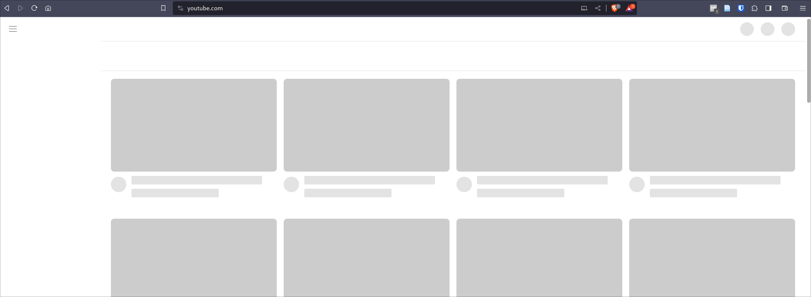
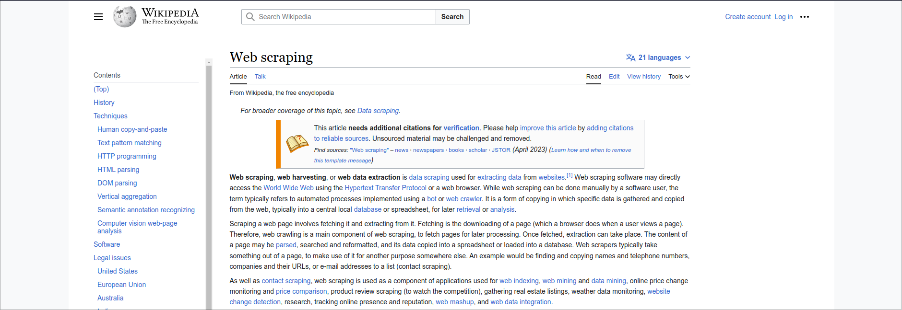
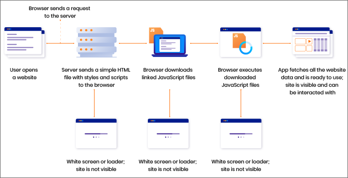
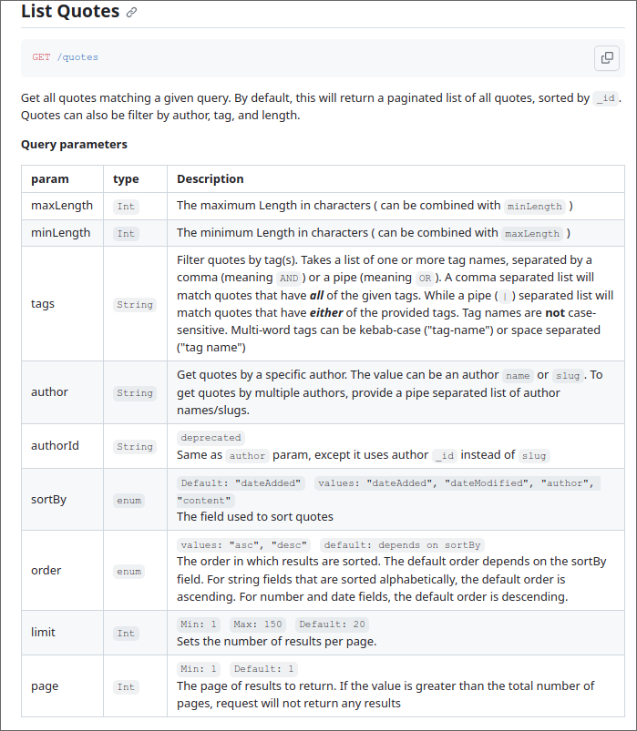
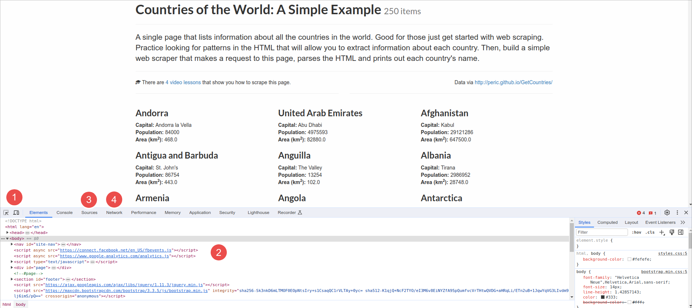
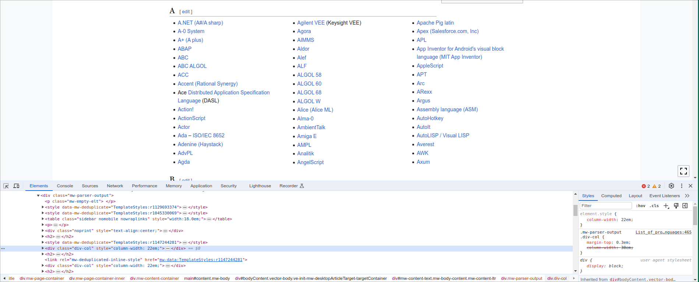
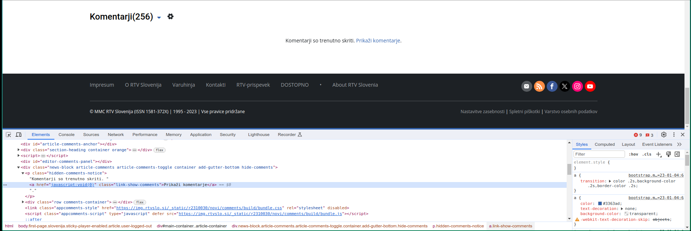
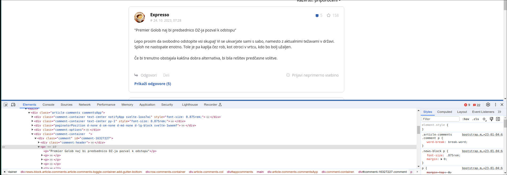

# Web scraping

**Live demo:** [repository](https://github.com/KlemenVovk/ids-tutoring-s2)

**Solve it yourself homework problem:** TBA after the tutoring session.

**Further practice: [here](https://www.scrapethissite.com/pages)**


## The why, when and how
**Why:** sometimes the dataset you want just isn't available (you've searched on [Google dataset search](https://datasetsearch.research.google.com/), [Kaggle](https://kaggle.com/) ...), or you're working with data with a time dimension and want the newest data (e.g. news, stock prices, etc.).

**When:** whenever you can't find a csv/json/other data file, but know where the data is online.

**How:** I propose a division of web scraping into 3 types:
1. Web scraping using APIs - here we request data from APIs that were exposed by the site itself.
2. Web scraping static websites - here we work with only HTML (no need for browser automation, just a simple request).
3. Web scraping with browser automation - here we automate a web browser to navigate the web page, trigger loading new data and saving it just as we would manually.

:::tip
If you have to do web scraping, always prefer 1. over 2. over 3. (the purpose of an API is to expose data - this is exactly what you want). However, it may not always be possible (the API might not be publicly available, it might be paid, it might not expose all the data you want, etc.). In this approach we say "I want this data with these properties in this format." and the API just gives it to us.

The second option is the easiest when an API is not available and the site loads all of the content you want in the initial HTML (no need to scroll to trigger additional image/comment loading etc.). In this we say "go to this URL and get the whole page that shows up.". This way we get everything that is initially displayed, however that might not be everything we want (e.g. you may need to scroll down to trigger comments to load, or you may need to login first etc.)

The third option is when all else fails and can work on any site you can view, however it is also way more error prone and can be clunky to execute, here we tell the browser "go to this site, enter the username and password, click login, wait 2s, scroll down to trigger loading of images/comments, get the comments etc.
:::

:::note
Many popular sites try to thwart web scraping on purpose (e.g. Instagram, Twitter, Facebook, Reddit). At the very least they throw a lot of roadblocks at you if you are doing browser automation (mandatory login to proceed, captchas, rate limiting, if a scraper is detected they can prevent you from accessing the site through IP bans etc.). These sites know that their data is valuable and will try everything to make you go the API route as the API is usually paid or your application needs to be approved (which is often a lengthy bureaucratic process) - the pricing can be very steep and well outside your resources (as demonstrated by the [2023 Reddit API pricing controversy](https://en.wikipedia.org/wiki/2023_Reddit_API_controversy)). Due to this, many ways of circumventing these measures were also made (automatic captcha solvers, using proxies to circumvent IP bans, blocking login popups etc.).
:::

## Wait, how does the web work?

Let's start by giving a brief introduction on how the web works. There's a LOT more to it, I will only mention some of the parts you need to be familiar with for web scraping.

### What even is a webpage?

A webpage is defined by three things:
- HTML (.html files) - this defines the structure (here's a headline, follow it with a paragraph and this image, then add a link, ...)
- CSS (.css files, sometimes can be directly embedded into .html) - this prettifies things (make this headline red, the width of this picture should be 700px, when the screen is less than X pixels wide (mobile phones) display columns one after the other rather than side-by-side...)
- Javascript (.js files, sometimes can be directly embedded into .html) - this adds dynamic elements to the webpage (when a user scrolls down, trigger loading of new images/comments, when the user logs in, change the text of this button to Logout, when the user clicks calculate, compute and display the result, ...)

We will primarily concern ourselves with HTML and CSS. Javascript is what actually causes problems (e.g. if we are scraping comments, it would be ideal if all the comments came in the HTML, however this is rarely the case, usually HTMl only contains the "comments section", but the actual comments are only loaded with Javascript once the user scrolls down far enough to see the "comments section"). Javascript makes sense from the user experience standpoint (why would we make the user wait for all 5421 comments to load in with the article, increasing the wait time by several orders of magnitude if we can only show the top 10 comments by default and then the user can request for more?), but is terrible for web scraping, because you usually want all the data, but all the data simply isn't there on the initial page load.

**This is where I would like to make the distinction between "static" and "dynamic" websites:** a static website ideally has no javascript whatsoever and all the data a user sees is already in the HTML itself, but this is quite rare. A dynamic website uses Javascript to load additional data after the page has loaded. An example of a static website would be Wikipedia, while a dynamic website is something like Youtube where comments, titles, subscriptions are loaded with Javascript after the initial page load.

**Why do we prefer static over dynamic pages for web scraping?**

Below we can see what Youtube looks like if we disable Javascript. If we enabled it, only what fits on the screen would be filled in (the technical term is hydration), and then if we scrolled down, additional videos (thumbnails, titles) would begin to load (this is not achievable without selenium).



If we compare this to a Wikipedia page with disabled Javascript, we can see that this is much more scraper friendly as mostly everything is already in the bare HTML with no requirement of hydration.



:::tip
To check if what parts of the website are static/dynamic you can disable execution of Javascript: open devtools in Chrome (F12), then check `Disable cache` (network tab), press `Ctrl + Shift + P`, search for `Disable Javascript` and execute that, then reload the page and see what's displayed.
:::

### How does a webpage load?
Below is a very simplified diagram of the process of loading a web page.



[image source](https://rubygarage.org/blog/how-to-integrate-ssr-for-react-app)

:::info
Technically, the method from the picture is called CSR (client-side-rendering). Roughly explained: first only the minimal HTML file is sent to the browser (remember the skeleton of the Youtube we saw?). The browser parses it and finds out that the HTML file has links to other files (i.e. CSS files, images, fonts, Javascript files, etc.), these are then requested and downloaded. Then the downloaded Javascript is executed and the webpage becomes interactive.

The server could pre-render some of the HTML and send it so that the client wouldn't have to do the work (e.g. the titles of the videos could be in the HTML already). This is called SSR (server-side-rendering). There are [MANY](https://www.locofy.ai/blog/what-the-heck-is-web-rendering) approaches to rendering web pages each with various impacts on web scraping. As a rule of thumb, for web scraping, you want as much of the data as possible to be loaded in with the base HTML and not filled in with Javascript later.
:::

## Web scraping using APIs

### But, what is an API and how does it differ from a website?
In short:, an API serves as a bridge for an application to access data or features from another application, while a website is designed for human users to interact with content through a web browser. A sample interaction is shown below:


[image source](https://mannhowie.com/rest-api)

As you can see, we talk to an API in the same manner that we talk to websites - through accessing specific URLs. There are two main things to point out:
- See how the response is not a .HTML file or a website that is displayed to a user, but rather a JSON file? This is great as JSON can be directly parsed to a Python dictionary without needing to do any HTML parsing magic.
- Other HTTP (HTTP is just a protocol - set of rules for communication on the internet) methods such as POST, UPDATE and DELETE are also used (a web browser mainly uses the GET method). This is because an API can also do some changes. In example: if you create a stock trading bot, it will probably use multiple GET calls to get the stock prices, while it will also buy/sell stocks for which it will use the POST method.

:::note
There are multiple ways (rules) of creating an API. The most popular, [REST](https://stackoverflow.blog/2020/03/02/best-practices-for-rest-api-design/),  is described above. Another popular set of rules is [GraphQL](https://graphql.org/)
:::

### Important terminology

Below is all the terminology I believe you should be familiar with for working with APIs:

- **Endpoint**: the specific URL where an API can be accessed, often representing a particular resource or function. For example storeapi.com/orders for accessing/operating on orders. What we want to do is then differentiated by HTTP methods, i.e. GET storeapi.com/orders will list the orders, POST storeapi.com/orders will create an order, DELETE storeapi.com/orders/3 will delete the order with id 3 etc. Creating an API that follows these assumptions will result in a better experience for the developers using it.
- **HTTP Methods**: Verbs used to indicate the desired action in an API request, such as "GET" for retrieving data or "POST" for submitting data.
- **Request**: An HTTP message sent by the client (you) to an API to retrieve data or perform an action.
- **Response**: The data returned by the API after processing your request, usually in JSON or XML format.
- **API Key**: basically a unique ID that identifies you to the API, often required for authorization.
- **Rate Limiting**: A restriction set by the API that limits the number of requests you can make within a specified time period. The limit may become more and more strict if a scraper is detected.
- **Query Parameters**: Additional data included in the URL to filter, sort, or modify the API response (e.g., search queries or date filters). This is anything after the `?` sign, e.g. `GET /quotes/random?minLength=100&maxLength=140` to get only quotes between 100 and 140 characters in length.
- **Body Parameters**: Data included in the body of a request, often used in "POST" requests to submit data to the API. Basically instead of writing your parameters in the URL itself after the `?` sign (as with query parameters), you send them as a dictionary (JSON) in the request body. Rule of thumb: GET and DELETE use query parameters only (`GET or DELETE /orders?id=123`), POST and PUT mainly use body parameters (`POST /api/users { "name": "John", "email": "john@example.com" }` or `PUT /api/users/123 { "name": "Updated Name" }`)
- **Pagination**: breaking up large API responses into several chunks (similar to how an online store has multiple pages of products that you click through). Some APIs include a pagination link in the response, you can then use this link to get the next batch of results (next page).
- **HTTP Status Codes**: Three-digit codes included in the API response to indicate how the request went (e.g., 200 for success, 404 for not found). Roughly, 200s are OK, 300s mean redirections, 400s are client errors (e.g. 404 if you request something that doesn't exist), 500s are server errors (you can't do much about these). Read more [here](https://developer.mozilla.org/en-US/docs/Web/HTTP/Status).

:::note
When to use certain status codes, HTTP methods, and pagination are just rules API developers should follow. However, there is no guarantee, and it is technically perfectly valid to create an API that only uses POST requests for everything and returns 404 if it encounters any error (server or client side). Working with such APIs is a nightmare and is why you should read up on REST API best practices before creating your own API.
:::


### How do we scrape data through APIs?


Scraping data through an API can be roughly described in the following steps:
1. Find an API and its documentation. Review limitations (rate limits, accessible data) and terms of service and respect those.
2. Get access to the API (if the API isn't free, you probably have to register to get an API key, think of it like a password you send with every request to prove to the API that you are allowed to do what you're trying to do).
3. Make some queries to get data.
4. Store the data.

:::note
Good API documentation is never guaranteed. This is one of the reasons why I recommended [FastAPI](https://fastapi.tiangolo.com/) in session 1, should you need to ever create an API yourself, because [FastAPI generates documentation for you automatically](https://fastapi.tiangolo.com/tutorial/first-steps/#interactive-api-docs). This type of documentation is displayed by [Swagger UI](https://github.com/swagger-api/swagger-ui), so if you ever come across the term "Swagger docs" you know what it is.
:::

:::note
Remember when we mentioned the [requests](https://pypi.org/project/requests/) library for talking to APIs in the first tutoring session? This is where we put it into practice.
:::

:::note
In session 1 I emphasized that sensitive information (secrets like passwords) should not be in git and should be stored in environment variables and accessed with [python-dotenv](https://pypi.org/project/python-dotenv/). This applies to API keys too!
:::

:::tip
Before scraping the API, always check if a library that does it for you already exists. For example, if you want to scrape Reddit through the API, there is no need to write all the API requests manually when you can just use the [PRAW library](https://praw.readthedocs.io/en/stable/) which does the heavy-lifting for you.
:::

<details>
    <summary>
    Let's do a simple example of scraping data from an API following the above steps.
    </summary>

**1. Find an API and its documentation**

As simple example we will scrape quotes from the [Quotable API](https://github.com/lukePeavey/quotable). Inspecting the documentation (in the README) we can see that the rate limit is 180 requests per minute and the base API url is `https://api.quotable.io`.

**2. Get access to the API**

The API is public and doesn't require any kind of authentication so we can skip this step. Should the API require anything along those lines, words like "API key", "OAuth" or "Register" will be mentioned.

**3. Make some queries to get the data**
Let's say that our goal is to get 300 quotes about wisdom and love that are at most 200 characters long. Again, [referring to the documentation](https://github.com/lukePeavey/quotable#list-quotes) we see the following:



So we must issue a GET request to `/quotes` endpoint with the following query parameters:
- `tags=wisdom|love` - notice, the `|` for separating different tags is defined by the developers, and it's not standard, but makes sense.
- `limit=150` - docs say that we can get at most 150 quotes at once, so we will have to make 2 requests with 150 quotes each.
- `maxLength=200`
- `page=1` - we need to make 2 requests to get 300 quotes in total, so this will be incremented to 2 in the second request (to get the second page of quotes).

:::tip
Always try to filter/sort/search your data through the API rather than downloading all the data and then using pandas to sift through. This takes the load of the API (less data sent = less requests to serve usually) and off of you (no need to write filters manually).
:::

Putting this into code:

```python
import requests
from pprint import pprint
import pandas as pd

API_ENDPOINT = "https://api.quotable.io/quotes"
N_QUOTES = 300

query_params = {
    "tags": "wisdom|love",
    "limit": 150,
    "maxLength": 200,
    "page": 1
}
results = []
for i in range(N_QUOTES // query_params["limit"]):
    # This is a GET request, so params are query parameters
    response = requests.get(API_ENDPOINT, params=query_params)
    response_json = response.json()
    pprint(response_json) # Pretty print the response JSON so we can actually read it
    # The actual quotes are stored in ["results"] of the response JSON (this is how the API developer defined it)
    results += (response_json["results"])
    query_params["page"] += 1
    print(f"Got {len(results)} quotes so far...")

# Convert the list of dictionaries to a Pandas DataFrame, thankfully pandas makes this easy
df = pd.DataFrame(results)
df.to_csv('quotes.csv', index=False) # Save the data to a CSV file
```

Console output (notice how the JSON is pretty printed because of `pprint()` and not in a single line!)
```
> python scrape_quotes.py
{'count': 150,
 'lastItemIndex': 150,
 'page': 1,
 'results': [{'_id': 'j7W6pP1XiG',
              'author': 'Charles Dickens',
              'authorSlug': 'charles-dickens',
              'content': 'Train up a fig tree in the way it should go, and '
                         'when you are old sit under the shade of it.',
              'dateAdded': '2023-04-14',
              'dateModified': '2023-04-14',
              'length': 92,
              'tags': ['Age', 'Wisdom']},
            ...
             {'_id': 'Juy6Vkv1y9V2',
              'author': 'The Buddha',
              'authorSlug': 'the-buddha',
              'content': 'In the sky there are no tracks. Outside there is no '
                         'recluse. There are no conditioned things that are '
                         'eternal. There is no instability in the Buddhas.',
              'dateAdded': '2021-02-27',
              'dateModified': '2023-04-14',
              'length': 150,
              'tags': ['Wisdom']}],
 'totalCount': 537,
 'totalPages': 4}
Got 150 quotes so far...
{'count': 150,
 'lastItemIndex': 300,
 'page': 2,
 'results': [...],
 'totalCount': 537,
 'totalPages': 4}
Got 300 quotes so far...
```

CSV output:
```csv
_id,author,content,tags,authorSlug,length,dateAdded,dateModified
j7W6pP1XiG,Charles Dickens,"Train up a fig tree in the way it should go, and when you are old sit under the shade of it.","['Age', 'Wisdom']",charles-dickens,92,2023-04-14,2023-04-14
6S4ONaVMZU,Aesop,Be content with your lot; one cannot be first in everything.,['Wisdom'],aesop,60,2023-04-03,2023-04-14
PlqVkGcCIp,Aesop,Beware lest you lose the substance by grasping at the shadow.,"['Wisdom', 'Philosophy']",aesop,61,2023-04-03,2023-04-14
RGw_9OPsR_,Aesop,It is easy to be brave from a safe distance.,['Wisdom'],aesop,44,2023-04-03,2023-04-14
t5-eBEIfiB,Aesop,Persuasion is often more effectual than force.,['Wisdom'],aesop,46,2023-04-03,2023-04-14
...
```

</details>

### Useful resources for working with APIs
- [JSON formatter](https://jsonformatter.curiousconcept.com/) - make JSON human readable.
- [HTTPie Desktop/Web](https://httpie.io/desktop) or [Postman](https://www.postman.com/) - GUI tools for manually calling/testing APIs.
- [HTTPie CLI](https://httpie.io/cli) or [curl](https://curl.se/) (you already have this installed probably, but HTTPie is more better for APIs) - CLI tools for manually calling/testing APIs.
- [jq](https://jqlang.github.io/jq/download/) - json formatter from the terminal.
- [pprint](https://docs.python.org/3/library/pprint.html) - builtin Python module for pretty printing stuff (formats JSON and basically all objects in Python).

## Web scraping of static websites

As seen above in the Wikipedia example, some sites are static enough to the point where we don't need to execute/load any Javascript as all the data is already in the HTML itself. In this case, we can use tools that only speak HTML, one such tool is the [beautifulsoup](https://www.crummy.com/software/BeautifulSoup/bs4/doc/) library for Python. Before we can scrape it, we need to get familiar with how it's actually built.

### Structure of an HTML file

The HTML file a browser downloads is a tree of elements. These elements can quite literally be anything and can be nested in one another. Let's take a look at a very basic HTML file:

```html
<!DOCTYPE html>
<html>
<head>
    <meta charset="UTF-8">
    <meta name="viewport" content="width=device-width, initial-scale=1.0">
    <title>Sample Web Page</title>
    <meta name="description" content="A basic web page for web scraping illustration.">
    <link rel="stylesheet" href="styles.css">
</head>
<body>
    <h1>Welcome to Web Scraping 101</h1>
    <p>This is a basic web page that we'll use to illustrate web scraping.</p>
    <ul>
        <li><a href="https://example.com">Visit Example.com</a></li>
        <li><a href="https://samplewebsite.com">Visit SampleWebsite.com</a></li>
    </ul>
    <h2>Sample Data</h2>
    <div id="data-container">
        <p class="data">This is the first data point.</p>
        <p class="data">And this is the second data point.</p>
    </div>
    
    <button id="sample-button">Click Me</button>
</body>
</html>
```

The HTML is always in two main parts: the visible part (anything inside `<body>` tags) - what the user sees directly, and the invisible part (anything inside `<head>` tags) - mostly metadata, also linked files (remember when we mentioned that a browser downloads the basic HTML and in that HTML there are links to other files such as fonts, CSS files, Javascript files, etc.?).

There are a lot of HTML elements for anything from headings (`<h1>` to `<h6>`, progressively smaller headings), links (`<a>`, short for anchor), paragraphs (`<p>`), buttons (`<button>`) to form elements (checkboxes, radio buttons, dropdowns, search fields) and images. You can view a more exhaustive list [here](https://developer.mozilla.org/en-US/docs/Web/HTML/Element). You can learn these as you go because you aren't required to write any HTML yourself. One more frequent tag you'll see is `div` (short for division, section), which does nothing on its own and is used to group elements together - i.e. we can put a bunch of links `<a>` into a `<div>` and change the background color to indicate importance or outline them with a black border to create a box around them...

One more thing you should notice is that elements can have (multiple) attributes (a link element needs to have a destination where the user will be redirected, this destination is specified in a `href` attribute, i.e. `<a href="https://example.com">`).

:::tip
#### As someone interested in web scraping only, I want you to pay attention only to the following things inside HTML:
- the tags of the elements (`<a>`, `<p>`, `<button>`, `<h1>`)
- how the elements are nested (which element is a child/sibling/parent of which element)
- the `id` attribute on any element
- the `class` attribute on any element

**Your goal when web scraping with HTML will always boil down to selecting the right element and getting some property of it (the text inside it, the destination if it's a link, etc.).**
:::

### Selecting the right element to scrape
Before we can get data from the element we are interested in, we have to select it. For this we use [CSS selectors](https://www.w3schools.com/cssref/css_selectors.php). There are 5 main ways of selecting elements in HTML, and you use them depending on your needs:

1. Selecting by tag names ("give me all `` elements") - this is useful when you want all elements of a certain type no matter at what level they are in the HTML tree. To use them, just specify the tag name i.e. `a`.
2. Selecting by class names ("give me all elements that have an attribute `class=something`) - classes are usually used to style multiple elements in the same way, e.g. do you see how the tips on this page always have a green background? If you take a look you will see that these tips are `div` elements with text inside them. So if we wanted to select all elements with tips, we couldn't just say `div`, because there are many other divs that aren't for tips. However, all tips have class `alert--success`, so we can select them with `.alert--success` (notice the dot!).
3. Selecting by ID ("give me this specific element) - this is useful when we want exactly one, unique element, e.g. there is usually just one login button with an `id=loginButton` attribute (or something similar), so we can select it (to press it) with `#loginButton` (notice the hashtag!).
4. Selecting by descendants ("give me all `<a>` elements inside `<footer>`") - this is useful when we can't really comfortably select by tag/class/id, maybe there's a `<footer>` at the bottom of a page that has contact links (`<a>`), we can select those links by `footer > p`. You can also select siblings (check the CSS selectors link above).
5. Selecting by XPath - a powerful system of selectors that can replace all of the above. It treats HTML as an XML tree (which is exactly what it is). You can read more about it [here](https://www.scrapingbee.com/blog/practical-xpath-for-web-scraping/). Using it is purely personal preference, we won't delve into it here, I will just show you how easy it is to automatically generate XPath selectors with Chrome devtools.

:::note
Usually there are multiple ways you can select an element and they all work. Stick to whatever feels natural to you.
:::

:::tip
You can use the starting point (root element) to your advantage. The default root element is `<html>` and all selectors are executed on whatever is inside it (which is everything). However, you can select a certain `<p>` as your root element and then run selectors against that. So if you want all links from a particular paragraph, you could first select that paragraph `<p>` and then use it as a root element to select all `<a>` elements inside it.

In general there is no need for you to get the element you want in one line of code. It makes perfect sense that if you e.g. you are scraping a news site and get an article, to first only select the `<div>` with all contents of the article and use that as the root for further scraping (this way you get rid of the navigation bar, buttons, headers, footers, etc.).
:::


### The bread and butter for site inspection: Chrome devtools
To find out what elements there are so that you know what selectors to write, you use the devtools of your preferred browser. These are opened by pressing `F12` on any site you want to inspect.



I would like to highlight the following elements (annotated with numbers on the image):
1. Press this and then select anything on the page and it will open you that element in the elements window below.
2. Elements window - here you can see the HTML that you will be scraping. You can right click any element and select `Copy` and then `Selector` or `XPath` to get a selector specific to that element.
3. Sources tab - here you can check the downloaded items (images, scripts, ...)
4. Network tab - here you can see all the requests that were made (this is also great if you are trying to reverse engineer an API).


:::note
Devtools are used for much more than just inspection, i.e. you can see how the website looks on mobile phones, you can check if the functionality works offline (if you have a calculator on the site, it makes sense to perform this computations locally, so internet connection isn't really needed beyond the first load), you can throttle your internet speed to see how the site performs on slow connections, you can take full page screenshots (`Ctrl + Shift + P`, search for `screenshot`) etc.
:::

<details>
    <summary>
    Let's do a simple example of scraping a static website
    </summary>

Our goal is to scrape all programming languages from [this Wikipedia page](https://en.wikipedia.org/wiki/List_of_programming_languages).

Let's inspect the page with Devtools:



We notice two things:
1. All elements that we want (programming languages) are links `<a>`
2. These links are always in `div` elements that have class `div-col`

This is enough to select them and scrape them!

```python
import requests
from bs4 import BeautifulSoup # conda install -c conda-forge beautifulsoup4
import pandas as pd

# URL of the Wikipedia page to scrape
BASE_URL = 'https://en.wikipedia.org'
url = BASE_URL + '/wiki/List_of_programming_languages'

# Send a GET request to the URL
response = requests.get(url)

# Parse the HTML content of the page using BeautifulSoup
soup = BeautifulSoup(response.content, 'html.parser')

# Find the main content of the page (class = div-col)
content = soup.find_all(class_='div-col') # note: class_ is used instead of class (class is a reserved keyword in Python)

# scrape the links from all divs with class=div-col
results = []
for div in content:
    links = div.find_all('a')
    for link in links:
        # Get the link text (what you actually see), and the link itself.
        results.append([link.text, BASE_URL + link.get('href')])

# convert the results list into a Pandas DataFrame
df = pd.DataFrame(results, columns=['language', 'link'])
df.to_csv('languages.csv', index=False)
```

Output csv:
```csv
language,link
A.NET (A#/A sharp),https://en.wikipedia.org/wiki/A_Sharp_(.NET)
A-0 System,https://en.wikipedia.org/wiki/A-0_System
A+ (A plus),https://en.wikipedia.org/wiki/A%2B_(programming_language)
ABAP,https://en.wikipedia.org/wiki/ABAP
ABC,https://en.wikipedia.org/wiki/ABC_(programming_language)
...
```

</details>

## Web scraping with browser automation
When we were using only beautifulsoup, you may have noticed, we couldn't interact with the page (we can't really click any buttons or scroll), we were dependent on everything we wanted already being present in the HTML on page load (this is why I chose Wikipedia :)).

This is where [Selenium](https://www.selenium.dev/) comes to the rescue. The **only** thing Selenium does is automate the web browser, so we can navigate to the page, scroll, login and click all we want. Once we have everything we want loaded we get the HTML and from there we can proceed in the exact same way as we did when we were using beautifulsoup (we can even pass the HTML to beautifulsoup, and use that).


### Prerequisites
Selenium needs a web browser (duh), and a web browser driver. The driver is basically a wrapper around a web browser that allows automation (so Selenium can just call something like `driver.click()` and then the driver will take care of telling the browser to click). This makes sense, because it would be a nightmare if the folks at Selenium had to develop the automation tools for each browser themselves. 

On some systems things just work out of the box. You can check by executing the following script:
```python
from selenium import webdriver
from selenium.webdriver.chrome.service import Service

service = Service()
options = webdriver.ChromeOptions()
driver = webdriver.Chrome(service=service, options=options)

# Navigate to the webpage you want to scrape
driver.get("https://www.google.com")

# Close the webdriver
driver.quit()
```

If everything works, a browser window should open, navigate to Google and close.

:::note
These webdrivers are a common source of issues (sometimes Selenium doesn't find it, sometimes the version of the driver or the browser is wrong etc.). If you run into any issues where the above script doesn't run, get in touch and I will try my best to help you solve it.

You can try troubleshooting yourself by steps outlined [here](https://www.selenium.dev/documentation/webdriver/troubleshooting/errors/driver_location/).
:::

<details>
    <summary>
    Let's do a simple example of scraping with browser automation
    </summary>

Our goal is to scrape the comments from [this RTVSLO article](https://www.rtvslo.si/slovenija/premier-naj-bi-predsednico-dz-ja-pozval-k-odstopu-ocita-se-ji-da-prepogosto-ravna-po-svoje/685890).

Let's inspect the page with Devtools:



We notice the following:
1. The comments are on the bottom of the page
2. The comments are not loaded by default and have to be loaded in by clicking `Prikaži komentarje` which is a `<a>` element with class `link-show-comments` 

Let's load the comments and inspect again:


We notice the following:
1. Each comment is in a `<div>` element with the class `comment`
2. The text is inside that `<div>` in one `<p>` element

So our plan is to load the page, scroll to the bottom, click `Prikaži komentarje`, get all divs that have class `comment` and get the `<p>` element to copy its text.

```python
from selenium import webdriver
from selenium.webdriver.chrome.service import Service
from selenium.webdriver.common.by import By
import time
import pandas as pd

service = Service()
options = webdriver.ChromeOptions()
driver = webdriver.Chrome(service=service, options=options)

URL = "https://www.rtvslo.si/slovenija/premier-naj-bi-predsednico-dz-ja-pozval-k-odstopu-ocita-se-ji-da-prepogosto-ravna-po-svoje/685890"
driver.get(URL)

# Scroll to the bottom of the page
driver.execute_script("window.scrollTo(0, document.body.scrollHeight);")

# click on "Prikaži komentarje"
driver.find_element(By.CLASS_NAME, "link-show-comments").click()

# wait for 3 seconds for the comments to load
time.sleep(3)

# find all divs with class "comment"
results = []
comments = driver.find_elements(By.CLASS_NAME, "comment")
for comment in comments:
    # Get the main <p> element and its text
    p = comment.find_element(By.TAG_NAME, "p")
    # get text and make it all one line
    text = p.text.replace("\n", " ").strip()
    results.append(text)

# Save the results to a CSV file
df = pd.DataFrame({"comment": results, "article_url": URL})
df.to_csv("comments.csv", index=False)

# Close the webdriver
driver.quit()
```

Output csv:
```csv
comment,article_url
"""Premier Golob naj bi predsednico DZ-ja pozval k odstopu""  Lepo prosim da svobodno odstopite vsi skupaj! Vi se ukvarjate sami s sabo, namesto z aktualnimi težavami v državi. Sploh ne nastopate enotno. Tole je pa kaplja čez rob, kot otroci v vrtcu, kdo bo bolj užaljen.  Če bi trenutno obstajala kakšna dobra alternativa, bi bila rešitev predčasne volitve.",https://www.rtvslo.si/slovenija/premier-naj-bi-predsednico-dz-ja-pozval-k-odstopu-ocita-se-ji-da-prepogosto-ravna-po-svoje/685890
"Kakšen je potem sploh smisel nekih kvot pa ne ven česa vse, če itak vsi morajo glasovati po nareku nekoga? Potem na te funkcije postavite pse in mačke, bo več koristi...",https://www.rtvslo.si/slovenija/premier-naj-bi-predsednico-dz-ja-pozval-k-odstopu-ocita-se-ji-da-prepogosto-ravna-po-svoje/685890
Podira se. Maja bomo na volitvah.,https://www.rtvslo.si/slovenija/premier-naj-bi-predsednico-dz-ja-pozval-k-odstopu-ocita-se-ji-da-prepogosto-ravna-po-svoje/685890
Ma dobro. A živimo ba Kitajskem? Odstopi naj Golob.,https://www.rtvslo.si/slovenija/premier-naj-bi-predsednico-dz-ja-pozval-k-odstopu-ocita-se-ji-da-prepogosto-ravna-po-svoje/685890
...
```

:::note
Notice how here, we didn't use the `requests` library anymore. We are using a proper browser to do the requests (and followup requests) for us.
:::

</details>


## Bonus: RSS feed scraping

There are other channels that websites use to provide new information. One such protocol is [RSS](https://en.wikipedia.org/wiki/RSS) (Really Simple Syndication), you probably know it by the following icon .

In short, it's a live feed of newly added things (usually articles). It can be very useful, as it's not as error prone as HTML scraping, a lot of sites (news, blogs) have it enabled and available by default. The feed is defined by a single file usually at `https://site.com/feed` or `https://site.com/rss` (i.e. [https://www.24ur.com/rss](https://www.24ur.com/rss)), or you can look for the RSS icon somewhere on the page.

In Python you can use the [feedparser library](https://pypi.org/project/feedparser/) to scrape RSS feeds. There are some limitations compared to API or HTML scraping, mainly, you can't really select/filter data, you just get access to a predetermined number of most recent elements (news articles, blog posts).

<details>
    <summary>
    Let's do a quick example of scraping an RSS feed
    </summary>

```python
import feedparser # conda install -c conda-forge feedparser
import pandas as pd
from pprint import pprint

FEED_URL = "https://www.24ur.com/rss"

feed = feedparser.parse(FEED_URL)
df = pd.DataFrame(feed["entries"])
df = df[["published", "title", "link", "summary"]]
df.to_csv("24ur.csv", index=False)
```

Output csv:

```csv
published,title,link,summary
"Mon, 23 Oct 2023 13:56:37 +0200",Sum kartelnega dogovarjanja z blagoslovom Darsa?,https://www.24ur.com/novice/dejstva/sum-kartelnega-dogovarjanja-z-blagoslovom-darsa.html," V luči našega razkritja, podkrepljenega s posnetkom v rubriki Fokus, da je davčni svetovalec Rok Snežič od skesanca za posel na Darsu zahteval podkupnino in jo tudi dobil, smo pod drobnogled vzeli aktualni javni razpis za avtovleke tovornih vozil. Očitno gre za nevralgično točko Darsa, saj se v omenjeni razpis vpleta sam predsednik uprave Darsa Valentin Hajdinjak. Razkrivamo pa tudi sum kartelnega dogovarjanja. Zakaj je razpis za avtovleke torej tako pomemben? Kaj se dogaja v ozadju?"
"Mon, 23 Oct 2023 13:16:00 +0200",Policija po razkritju domnevnih nepravilnosti na Darsu obiskala POP TV,https://www.24ur.com/novice/slovenija/policija-po-razkritju-domnevnih-nepravilnosti-na-darsu-obiskala-pop-tv.html," Po razkritju domnevnega podkupovanja, izsiljevanja, suma korupcije, favoriziranja in spornih javnih razpisov, vse v povezavi z največjo državno družbo Dars, se je Policija nemudoma odzvala ter na naši medijski hiši zaprosila za predajo dokumentacije in posnetkov. Slovenski državni holding pa je na sestanek pozval celotni nadzorni svet in upravo družbe za avtoceste. Ob tem zagotavljajo, da namerava SDH izkoristiti vsa razpoložljiva sredstva, da se morebitna koruptivna dejanja v bodoče preprečijo, morebiti že izvedena pa raziščejo in ustrezno kaznujejo. Da bodo zadevo prednostno obravnavali, pa zagotavljajo tudi na Komisiji za preprečevanje korupcije."
"Mon, 23 Oct 2023 20:06:00 +0200","Paketi prehranske pomoči kopnijo, donacij je vse manj",https://www.24ur.com/novice/slovenija/Paketi-prehranske-pomoci-kopnijo-donacij-je-vse-manj.html," Na Zvezi prijateljev mladine Moste - Polje so čedalje bolj zaskrbljeni. Na njihovo pomoč trenutno računa več kot 300 družin, veliko se jih mora vsak mesec odločati med nakupom hrane in plačilom položnic. Kako jim bodo pomagali brez pomoči donatorjev, ne vedo, saj je zalog hrane le še za približno dva tedna. Zato pozivajo k donacijam, državo pa k ukrepanju."
"Mon, 23 Oct 2023 18:30:44 +0200",'Janša načrtno povzroča kaos in izredne razmere',https://www.24ur.com/popkast/jansa-nacrtno-povzroca-kaos-in-izredne-razmere.html," Največja opozicijska stranka SDS je v javnomnenjski podpori prvič občutneje odskočila od Gibanja Svoboda. Raziskava Inštituta Mediana kaže tudi, da vladna politika že drugi mesec zapored izgublja javno podporo. Je premier Robert Golob ministrico za kmetijstvo Ireno Šinko in ministra za okolje Uroša Brežana 'odstavil' prepozno? Zakaj prvak SDS-a poziva ljudi, naj se legalno oborožijo? Gosta tokratnega Popkasta sta bila odgovorni urednik Mladine Grega Repovž in odgovorni urednik portala Necenzurirano Primož Cirman."
...
```

:::tip
An example use for RSS could also be to get links to scrape - if you're scraping a news site for new articles constantly, it would be very beneficial to know which articles are new and which you've already scraped. Since each article in the RSS feed comes with a link pointing to it, it's a great, robust way to get the links you want to scrape without having to resort to the error prone HTML scraping or browser automation.
:::

</details>

:::note
A more modern alternative to RSS feeds are [Atom](https://en.wikipedia.org/wiki/Atom_(web_standard)) feeds, which can also be scraped with feedparser.
:::

## General tips

- When doing browser automation, it's useful to throw in some `time.sleep(SECONDS)` to wait for the page/elements to load, or just to do things slower, so you can see what's happening when debugging.
- When doing browser automation, keep the browser window size constant, as if the site is responsive (any site that adjusts to mobile screens), it can change a lot when the layout changes from full-width desktop, to half-width or even mobile causing your selectors to stop working. (e.g. the search bar might be hidden behind a hamburger menu on mobile, so you can't just select it and enter text, but have to open the menu first).
- Browser automation can be used for more than just scraping. Think of automated testing of web applications.
- When you are done writing your scraper with Selenium, try to switch to [headless mode](https://www.selenium.dev/blog/2023/headless-is-going-away/) (launches a browser, but behind the scenes, you don't see a window) - this is also useful if you are running a scraper on a server with no GUI at all.
- It's normal for your scraper to break (especially if you are doing browser automation) as you are at the mercy of the developers of the website. If they change the structure, your scraper breaks. This is why I recommend saving the data ASAP and ditching the scraper.
- Try to only send requests exactly for what you need. For example, if you are scraping news articles about a specific topic, it makes sense to use the search functionality of the site (if there is one), to narrow down your selection. Furthermore, the headlines of the topics will probably be visible in a list so you can scrape those and then decided for each topic if you want to send a request to open the article or not.
- Always try to be nice to the websites you are scraping, don't swarm them with requests. You are also very likely to trigger bot countermeasures and will be rate limited making your scraping take even longer.
- Sites have robots.txt which is usually at `https://site.com/robots.txt` which defines who can scrape what (e.g. many sites allow Google to scrape them, so that they can be in the search results, but have no reason to allow you to scrape them). This isn't particularly enforced and is more of a "please don't do this and that", but you should still try to respect this. e.g. [Wikipedia robots.txt](https://en.wikipedia.org/robots.txt)
- Sometimes sites have poor search functionality. You can use the power of Google to your advantage. For example, if you want to scrape Reddit for cat pictures you can search `site:reddit.com cat pictures` to make Google search only on Reddit. There are [many such refinements you can do to your Google searches](https://support.google.com/websearch/answer/2466433?hl=en).
- Make sure that `Disable cache` is checked in Devtools (network tab), so that your browser and the instance of the browser that Selenium uses see the same thing (there's no caching going on).

## FAQ
### How do I scroll to the bottom with Selenium?
For this you execute a Javascript script. You can do this from Python with:
```python
driver.execute_script("window.scrollTo(0, document.body.scrollHeight);")
```

### I can't click or copy something from the page with Selenium, but I know the selectors are correct
There are many possible reasons why, here's some tips:
- Try adding some `time.sleep(1)` statements to give the browser time to load everything properly
- Selenium can only click on something that is visible in the browser window. So if a button you are trying to click is on the bottom of the page and you can't see it without scrolling down, you need to scroll down before you can select it.


### When I reload the webpage in my browser, changes I made persist (some buttons don't need clicking again, etc.) so now I can't inspect the correct elements (i.e. the login button was hidden because I already logged in).
Open incognito mode in your browser and navigate to the page.
