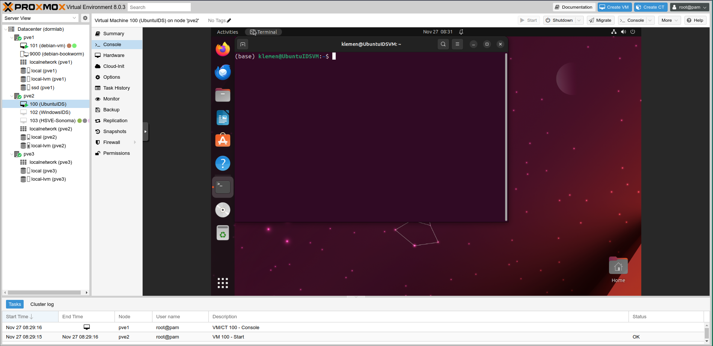
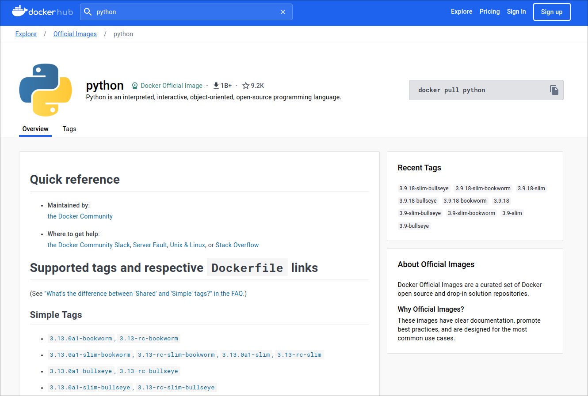

# Docker and docker compose

**Live demo:** [repository](https://github.com/KlemenVovk/ids-tutoring-s3)

**Solve it yourself homework problem:** TBA after the tutoring session.

**The goal is to motivate and introduce containerization (and Docker) through a practical story. The story is about a data scientist deploying a model in various ways, failing, and adjusting.**

## The story

**based on true events... :)**

### Chapter 1: the model

The company you are working at is producing metal parts of various dimensions (given by x, y and z) from different materials (steel, aluminum, copper) through different processes (turning, drilling, milling). The parts can be of varying complexities (an integer between 1 and 10), and for each we have the time it took to produce it in minutes. This is also our target variable. The hope is that the model will be able to predict how long a certain part will take to produce, which will help with scheduling different parts and increase efficiency (therefore increasing profits as more parts can be produced).

A few lines from the dataset:
```csv
x_cm,y_cm,z_cm,material,complexity,process,time_min
31.95,19.82,12.55,aluminum,7,turning,630
38.61,5.25,8.19,steel,1,drilling,771
34.11,16.9,8.8,steel,5,drilling,659
31.8,22.72,5.26,aluminum,5,drilling,590
```

*Note: this is a synthetically generated dataset, the generating code can be found [here](https://github.com/KlemenVovk/ids-tutoring-s3/tree/master/live_demo/0_preparation)*

You do all the steps of the usual data science pipeline and come up with a random forest model that seems to work well for what you are trying to do. The code for the model is available [here](https://github.com/KlemenVovk/ids-tutoring-s3/blob/master/live_demo/1_traditional/model.py).

### Chapter 2: passing around Python scripts

You are certain that your model can increase profits. However this will only happen if people actually use your model and that will only happen if it's easy to use.

Here comes the first problem: your model currently runs pretty much only on your machine and only you know how to run it. Running python scripts (in the correct environments with correct packages) is NOT really something you want to explain to non-tech-savy people. You need to figure something out. After some thinking, you figure, it's only the mechanical engineering department manager that needs to use this, so you can just borrow their laptop for 20 minutes, install python, create the environment, and give a short lesson on how to use the model, **but it's ok, you only have to do it once**. You create a [simple Python script that allows using the model for prediction](https://github.com/KlemenVovk/ids-tutoring-s3/blob/master/live_demo/1_traditional/predict.py)

So the current way to use the model is as follows: you pretrain the model and export it as a pickle file. This pickle file along with the prediction script is given to the manager. To predict it's then enough to have the model in the same folder as the script and run the script with the input features:
```bash
# python predict.py model_location, x, y, z, material, complexity, process
python predict.py model.pkl 30 15 10 steel 5 milling
```

The manager learns how to use the model, company profits increase, everyone is happy. Time passes and due to increased efficiency because of your model, the company can start producing 1 more type of part, which your model also needs to predict. This requires you to create a new version of the model, go to the manager, borrow his laptop again, recreate the environment and update the model on his PC (or would you rather explain Git and Python environments to him so he can do it himself?). Furthermore, the manager is getting overwhelmed with the number of parts he has to process and would like to delegate some of the work to 4 other people. Now you need to do the same installation and explaining for them too. You just learned the hard way that passing python scripts around to deploy models is NOT the way to go. You need to somehow centralize the access to the model so that you have only 1 deployment that everyone uses.

### Chapter 3: centralizing the model

Remember when we talked about APIs (specifically [using FastAPI to create an API for your model](https://klemenvovk.github.io/ids-tutoring/session1#useful-external-libraries))? You realize it would be way better if you could talk to your IT department and they gave you access to one of their servers where you could deploy your API and then everyone can use it through their web browser.

Ok, you cushion your chair, oil your keyboard and code out an API for your model, all in 1 night of extreme red-bull fuelled extravaganza. Now you send an email to IT asking for access to a server so that you can deploy your model. IT gives you SSH access to a server (remember when we talked about learning how to use the terminal and ditch the GUI?). Ok, now you spend the whole day preparing the operating system, and everything required (updating system packages, logging into Github, installing python, cloning the repository, creating the environment, etc.), **but it's ok, you only have to do this once**. Luckily, you managed to deploy your API on the server and everyone can access through their web browser. There is also no need to do an in-depth explanation on how to use the API because you provided the documentation too (remember when we talked about the benefit of FastAPI and similar tools that will automatically generate documentation for you?). Now when you need to update it or the model behind it, you can do it yourself on the server and that's it. Days pass by, everything seems to be in order. People are using your model and the company is working more efficiently.

:::danger
DO NOT use SSH with passwords. There is no excuse, always use public/private key pairs for SSH authentication. Stress this to anyone who gives you SSH access with a password. You can use the public key you have on your Github for SSH access, so people who are giving you access can use tools like [ssh-import-id](http://man.he.net/man1/ssh-import-id-gh) to import your keys just by knowing your Github username.
:::

The code for this version of your endeavour can be found [here](https://github.com/KlemenVovk/ids-tutoring-s3/tree/master/live_demo/2_api). The only thing we added is a script for the API:
```python
from predict import predict_one # the function from our predict.py script
from fastapi import FastAPI
import time

app = FastAPI()

@app.get("/predict")
def predict(x: float, y: float, z: float, material: str, complexity: int, process: str):
    time.sleep(5) # Simulate a long computation, we'll motivate this later
    y_pred = predict_one('model.pkl', x, y, z, material, complexity, process)
    return {'time_min': y_pred}
```

The API can be run by installing the requirements from `requirements.txt` and running (from the `2_api` folder):

```bash
# the "api" is referring to the api.py file, and the "app" is referring to the app = FastAPI() object inside the api.py file
uvicorn api:app
```

:::note
Uvicorn is basically a server that can handle multiple connections to your app (in this case the FastAPI api) at the same time. There are also tools like [Gunicorn](https://gunicorn.org/) which will run multiple instances of your API/web app in the background in parallel in case you have many requests, and divide the requests equally between the instances, allowing you to scale.
:::

### Chapter 4: the need for isolation - virtual machines

One morning your phone starts blowing up with people saying that your model is inaccessible/not working. You immediately become suspicious as you haven't changed anything. You SSH into the server to investigate. You can see that your Python app isn't running anymore, but that's about it since you didn't bother with implementing logging. After contacting IT you find out that the server was restarted at midnight to apply security updates. However, you are sure that you have implemented auto startup of your API on boot, so you go to double check. You find out that your startup script has been replaced with someone else's, so it's not even being executed. So someone accidentally destroyed your deployment as a side effect of deploying theirs and you only found out because of the system update.

You start thinking again. There has to be a better way of doing this. You can't just sit tight and hope no one else accidentally destroys your deployment. If only you could have a system that was just yours and isolated from everything else, yet running on the current company infrastructure. You search the web and come across these things called virtual machines and find out that it's basically a virtual computer created inside your computer and is completely isolated from it. You inform IT of this possibility and after some complaining they create a virtual machine for you and give you SSH access to it. This way they have created a tiny, less powerful computer on their server, just for you. Ok, now you spend the whole day preparing the operating system, and everything required (updating system packages, logging into Github, installing python, cloning the repository, creating the environment, setting up API autostart on boot, etc.), **but it's ok, you only have to do this once** (do you start to see a pattern?). You manage to get everything back up and running in 2 days. Things seem to be back on track.

Below is a screenshot from a VM hypervisor (a hypervisor is just a fancy name for a program that manages virtual machines) known as Proxmox. You can see that it's just a computer inside a computer.



:::note
You usually don't get access to a GUI if the VM is somewhere on a server. This is because GUIs waste resources, and configuration through SSH is quicker (and often easier) than using a remote GUI. This is also one of the reasons why specialized Linux distributions exist just for servers - e.g. [Ubuntu Server](https://ubuntu.com/server) (which is for the most part just Ubuntu without a GUI).
:::

:::tip
There are two groups of hypervisors - type 1 and type 2. A type 1 hypervisor ([VMWare ESXi](https://www.vmware.com/products/esxi-and-esx.html)) operates directly on the hardware, serving as the host operating system for virtual machines without needing an underlying OS. It is more efficient and is typically used in enterprise environments. In contrast, a Type 2 hypervisor ([VMWare Workstation](https://www.vmware.com/products/workstation-pro.html), [VirtualBox](https://www.virtualbox.org/)) runs on top of an existing operating system and is more suitable for personal or development use, but tends to have lower performance compared to Type 1. In other words: a type 2 hypervisor is just a program that you install on your OS, a type 1 hypervisor IS an OS. If you want to try VMs on your own, just install a type 2 hypervisor on your OS.
:::

:::tip
There exist tools that automate creation and configuration of VMs. If you want to read more, check out [Vagrant](https://www.vagrantup.com/), [Terraform](https://www.vagrantup.com/), and [Packer](https://www.packer.io/). There are also general IT automation frameworks such as [Ansible](https://www.ansible.com/). The lines between them are generally blurred (e.g. you can use Vagrant for everything, or use Terraform just to create a VM and Ansible to configure it etc.)
:::

### Chapter 5: noisy neighbors

In your regular end of the week meeting, you explain why the crash from Chapter 4 ocurred, and how you addressed it and made sure it doesn't happen again. Other people who have stuff deployed on the server see the benefit of VMs and start asking IT for their own VMs. This works for some time, and IT is creating VMs. The server has 64 GB of RAM, and they are giving everyone the same VMs with 8GBs of RAM assigned. Soon they run out of RAM to give out, and ask management for better hardware. Management declines to avoid expenses, but IT figures that no one is using the whole 8GB of RAM, so theoretically, they can assign more VMs and as long as each VM is not using all RAM, it should be fine. This works up to a point, but then some people deploy heavier deployments and start using the whole RAM, which degrades the experience for others (because the same portion of RAM is allocated to multiple VMs) - the so called [noisy neighbor problem](https://www.techtarget.com/searchcloudcomputing/definition/noisy-neighbor-cloud-computing-performance). IT starts threatening removal of VMs and things start to grind to a halt between logistic and technical problems.

:::note
The noisy neighbor problem can happen with many resources, not just RAM, but also CPU, network bandwidth, disk IO etc.
:::

Again, you figure there has to be a better way to do this. You agree with IT that you don't need a machine with 8GB of RAM for your simple model, and your VM is therefore hogging resources it doesn't need, but you also need isolation from others and don't want to return to the pre-VM era. After some googling you run into the concept of containers, which seems like it's exactly what you need. Recall, virtual machines emulate entire operating systems, providing isolation but incurring higher resource overhead and longer startup times. Think of VMs as mini-computers within your computer. On the other hand, containers encapsulate applications and their dependencies, sharing the host OS kernel. They are lightweight and start almost instantly. Picture containers as self-sufficient, portable packages that can run consistently across various environments. For data scientists, the choice boils down to resource efficiency and ease of deployment – VMs offer stronger isolation but at a cost, while containers provide agility and consistency with minimal overhead.

:::note
Containers are not strictly better than VMs. Sometimes you NEED a VM. For example, you might need to run a Windows only application - this isn't really feasible with docker containers. It's even worse if you need an older Windows version like Windows XP. In these cases you would turn to a VM.
:::

:::danger
While VMs and containers offer isolation, you have to be careful. For example if a VM is connected to your network, then if someone breaks into the VM, it automatically has network access to all the other devices in your network. Same goes for mappping folders - sometimes you want to map a folder from your host to a VM. This means that if a virus happens to get into the mapped directory, it is also on the host!
:::

So to run our API we need a Python installation with the libraries from requirements.txt and the code. In other words we need to perform the following:
1. Get a OS with Python installed.
2. Install everything from requirements.txt
3. Copy the code and the model
4. Run our API

We need to define a container that will perform the above steps. A container is defined by a `Dockerfile` (a nice cheatsheet for everything Docker is available [here](https://dockerlabs.collabnix.com/docker/cheatsheet/)). From the Dockerfile you can build container images. You can then use these images to launch a container.

Let's tackle step 1. We need to find a base container image. We need an OS with Python. If we search [Docker Hub](https://hub.docker.com/) (a repository of container images) for Python we find the [offical Python container image](https://hub.docker.com/_/python)



You notice there are many tags, like `3.12.0-bookworm`. These denote different versions and base images (just like we are using the Python container image as a base for our container, the Python container image uses Debian - a linux distribution as its base). In this case `3.12.0` is the Python version in the image, and `bookworm` is the Debian version ([Debian 12 - bookworm](https://www.debian.org/releases/bookworm/)).

:::tip
you may also find tags like `-alpine` which means that container image is using the Alpine linux distribution as it's base. Alpine is a really small Linux distribution which greatly reduces attack surface for breaking in/out of containers and resource consumption.
:::

**Step 1: Get a OS with Python installed.** Let's define our Dockerfile (addresses step 1):
```Dockerfile
# this is the image:tag from Docker HUB
FROM python:3.12-bullseye
...
```

**Step 2: Install everything from requirements.txt.** Now we need to install libraries from requirements.txt. However, the container is currently stock - it doesn't have our requirements.txt, so we must first copy the requirements.txt from our computer to the container. Once we have it, we can run pip install.

```Dockerfile
...
# Where we are in the container (basically equivalent to 'cd /app')
WORKDIR /app

# Set up python environment
# This is the first thing so that docker can cache it (changes later/below in the file will not invalidate this layer)
COPY requirements.txt /app
RUN pip install -r requirements.txt
...
```

**Step 3: Copy the code and the model.** Same as with requirements.txt, the container currently doesn't have our code (it's just the base container from Docker Hub, with the requirements.txt copied from the previous step). Let's copy the code and the model:
```dockerfile
# Copy code
# If copying a directory, the destination must end with a slash
COPY src/* /app/

# Copy model
COPY model.pkl /app
```

**Step 4: Run our API.** Finally we need to run Uvicorn as in Chapter 3. Remember when we launched our API in chapter 3, the output was the following:
```
❯ uvicorn api:app             
INFO:     Started server process [10995]
INFO:     Waiting for application startup.
INFO:     Application startup complete.
INFO:     Uvicorn running on http://127.0.0.1:8000 (Press CTRL+C to quit)
```
From this we know, that the API is by default accessible `http://127.0.0.1:8000` (equivalently, `http://localhost:8000`). Pay attention to the port number (8000).

:::note
A port is simply a mechanism of accessing different applications on the same IP/destination. i.e. we could have FastAPI running on port 8000, and then a completely separate webpage running on port 3000. So if we want to access the FastAPI, we go to `http://localhost:8000` and if we want to access the website we go to `http://localhost:3000`. Note that the IP address/domain (localhost) is the same for both as they are running on the same computer!
:::

Therefore we have to tell the container to make the port 8000 accessible from the outside. Then we have to run Uvicorn:
```dockerfile
# Expose port 8000 from the container to the host
EXPOSE 8000

# Run the app
# note how below we had to pass an array of arguments, if we were running this from the terminal, the equivalent would be
# uvicorn api:app --host 0.0.0.0 --port 8000
CMD ["uvicorn", "api:app", "--host", "0.0.0.0", "--port", "8000"]
```
The `--host 0.0.0.0` is a common occurrence across different servers, it just tells Uvicorn that it should listen on port 8000 for connections from anywhere, by default it only listens on port 8000 for connections from localhost (in this case the container) - in other words, without the `--host 0.0.0.0`, the API would only be accessible from `http://localhost:8000` INSIDE the container. Remember, `localhost` on your host maps to your PC, and `localhost` in the container maps to the container!

That's it! Now we only have to build the docker image, and give it a tag (similar to how Python had the tag `3.12.0-bookworm`). Let's keep it simple and tag our image `idsdemo`. From the directory with the Dockerfile run:
```bash
# the dot '.' refers to the current directory (that's where the Dockerfile is)
docker build . -t idsdemo
```

Now that we have our image ready, we can create a container from it with:
```bash
docker run -p 4000:8000 idsdemo
```

Notice the `-p 4000:8000`. To make our container accessible from the host, we have to map a port on the host to a port in the container. The format is always `-p HOST:CONTAINER`. We exposed the port 8000 in the container (with `EXPOSE 8000`), now we can pick any, non used port on the host and map to it. In this case, we picked 4000.

:::info
This is also an advantage of using Docker. You know that Uvicorn by default runs on port 8000. What if you want to have two different APIs (so two different Uvicorns)? Well we can containerize both and run one with `-p 4000:8000` and the other with `-p 5000:8000`. This way we don't have to reconfigure Uvicorn to use a different port. Some applications make it VERY hard to move them to a different port, so this is an easy solution.
:::

### Chapter 6: simplifying deployment with docker compose

Running `docker build` and `docker run` with the correct parameters quickly becomes cumbersome. This is where `docker compose` comes in. It's a way to define the build and run commands in a single configuration file that we can then deploy with a single command. The file is a YAML file named `docker-compose.yml`.

Below is the equivalent of Chapter 5 in docker compose
```yaml
version: '3'
services:
  api:
    build:
      context: ./api
      dockerfile: Dockerfile
    ports:
      - 4000:8000
```

The above tells to use docker compose version 3. Then it only defines 1 service (called api), the image for the service is built from the `./api` subfolder and the Dockerfile is in `./api/Dockerfile`. The it also maps the port from the host to the container.

We can deploy the above by running
```bash
docker compose up
```

:::note
`docker compose` and `docker-compose` are equivalent. They both exist because `docker-compose` was a standalone, separate project (so it was a different command), and then Docker adopted it as a subcommand of the `docker` command.
:::

:::danger
If you are changing anything in your Dockerfile, you sometimes have to force a rebuild of the container images by running `docker compose up --build`
:::

Other commands you should know:
```bash
docker compose up -d # runs the stack in the background, -d stands for detach
docker compose down # stops the containers and deletes them
# I personally recommend avoiding using the below two, containers are like cattle and should always be replaced, never restarted.
docker compose start # starts the containers (if they were stopped at some point)
docker compose stop # stops the containers (but doesn't delete them)
```

### Chapter 7: adding another container into the mix


### Chapter 8: persisting container data

### Chapter 9: using environment variables for configuration and passing secrets

Mention that being able to run docker means you are root - and you wouldnt get access to this or devops would take over from here once you create the container etc.

Mention the possibilities now such as scaling, auto restarts, different ports, logging, noisy neighbor problem


## Terminology


## General tips

## FAQ
### Question
answer


## TODO
- mention devcontainers
- mention scaling/kubernetes
- mention vagrant