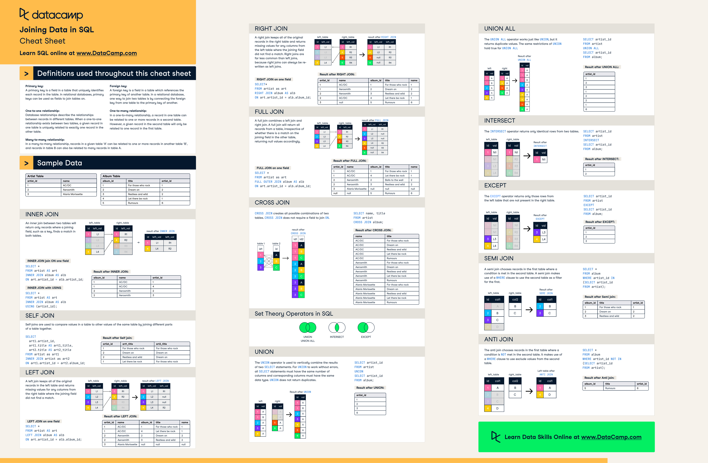
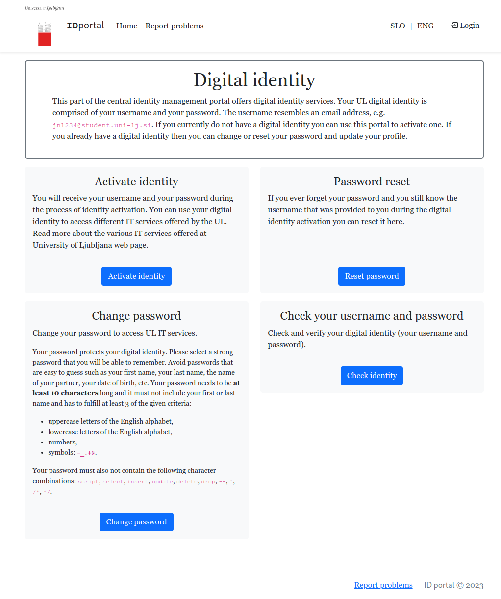

# Databases

**Live demo:** [repository](https://github.com/KlemenVovk/ids-tutoring-s4)

**Solve it yourself homework problem:** TBA after the tutoring session.

## But why? Aren't CSVs/Excel enough?

At first glance, introducing and/or using a database seems like a lot of additional work for achieving what CSV (or any other format) can do without any additional effort.

:::note
This is also the stance of the industry, as a lot of things are stored in Excel to this date. Introducing a database can be very time consuming (after all, there are people who create and manage databases for a living), while basically everyone is expected to know how to use Excel.
:::

Rather than list a bunch of theory on advantages/disadvantages of using a database, I will provide some actionable advice:

### You should use a database if:
- **you have a large amount of data:** CSVs/Excel become increasingly unusable as the amount of data increases (this is especially true if you have lots of formulas in Excel). A rule of thumb is if you can't read all of your data in RAM (e.g. do a single `pd.read_csv()`).
- **speed is crucial:** doing data querying/filtering in SQL/NoSQL is usually orders of magnitude faster than doing it with Pandas etc.
- **your data has complex relationships:** if you have multiple tables connected with each other through 1:1 or 1:N relationships (e.g. products-customers-purchases), dealing with multiple CSV files (writing/retrieving data) is clunky.
- **multiple users need to interact with the data:** passing a CSV file around is NOT the way to go. Especially if multiple users need access at the same time (data conflicts).
- **you need to restrict access (what someone can do with the data)**.
- **you need to scale:** if there may be many requests to the data at the same time.

### You should be fine without a database if:
- **you are the only one that needs access to the data.** You don't need the scalability and granular security that a database offers.
- **your data is mostly read-only**: e.g. reading a dataset for training a model. There is no point in introducing the power of database if you will read everything at once anyway.
- **your data is simple:** more specifically, there are no relationships (i.e. only 1 or 2 tables that aren't really connected).

:::note
As we will discuss below, there are other, nonrelational databases, that don't use SQL for querying (online you might encounter these under the NoSQL umbrella term). Personally, I use the above advice to decide if I need a database or not, and then if I do, I research which database to use for the use case.
:::

:::tip
ALWAYS do scaling with the technology natively provided by the database itself. DO NOT prefer using Kubernetes or anything else as it is way more error prone and clunky. The people that designed the database should also know how to design the best system for scaling/redundancy for that database.
:::

:::tip
Always try to filter/prepare the data as much as possible in SQL, before brining it into your programming language of choice. Ideally, the data returned by SQL should be ready (in the appropriate format) for your application. Doing it later will almost always be way slower and clunkier. SQL is very powerful and fast, use it if you can.
:::

## Types of databases

There are many types of databases, each saving data in its own way and each having its own way for querying/updating (e.g. SQL, Mongo Query Language...). For the sake of brevity let's mention some types and give examples of databases implementing them (these are nor exclusive nor exhaustive):
- Relational databases: organize data into tables with predefined relationships ([MySQL](https://www.mysql.com/), [PostgreSQL](https://www.postgresql.org/), [Oracle](https://www.oracle.com/database/)). You use SQL for interacting with these.
- Non-relational databases: organize data with very flexible structures (e.g. MongoDB uses collections of documents - dictionaries).
- In-memory databases: store data in RAM for ultra-fast access. Remember when we talked about [using Redis for caching](https://klemenvovk.github.io/ids-tutoring/session3#chapter-7-adding-another-container-into-the-mix)?
- Graph databases: store graphs (as in nodes and edges), e.g. Neo4j.
- Time series databases: designed for time series data - logging, IoT, e.g. InfluxDB.
- Vector databases: store vectors (i.e. embeddings of data) and implements querying by distance etc. An example of a vector database is pinecone.

:::tip
While there are many types of databases (with new ones regularly being proposed), for the vast majority of use cases a relational database (e.g. PostgreSQL) is all you need. There are many SQL features that already solve a problem a certain type of database addresses, but tend to get overlooked (i.e. indexing) and then another type of database with less support gets chosen. If you already have a database available, think twice before introducing another, as usually it's easier to have only one database due to maintenance.
:::

For the rest of this session, we will focus only on relational databases, using SQLite as a concrete example as it is easy to setup and work with. Should you need something production-ready and well-supported, a good recommendation is [PostgreSQL](https://www.postgresql.org/), as it has been [the most popular database for a few years in a row now](https://survey.stackoverflow.co/2023/#section-most-popular-technologies-databases).

## Key terminology
- **DBMS** - short for Database management system, this is the software that actually implements the database.
- **Query language** - a language you use for querying/updating the database. We will deal only with SQL, however there are others.
- **Relation** - a concept from [relational algebra](https://en.wikipedia.org/wiki/Relational_algebra) that refers to a set of tuples (rows) that have the same attributes (columns) with defined data types. This is why a table is a natural way to represent a relation, however a table is NOT equivalent to a relation (we can get different relations if we select different subsets of columns in a table). However, you will see "relation" and "table" used interchangeably.
- **Primary key** - a unique value that identifies a row. In a "Employees" table that might be a column of "Employee ID number".
- **Foreign key** - a primary key from another table. I.e. if we have a "Departments" and "Employees" tables, each department may have multiple employees, but each employee is in exactly one department (so N:1 relationship). In the employees table, we would like to know for each employee, in which department they work. Therefore in the "Employees" table we have a primary key "EmployeeNumber" uniquely identifying an employee, and a foreign key "DepartmentID" (which are values from the column "DepartmentID" in the "Departments" table).
- **Normalization** - when designing databases, we often have duplicate/redundant columns/rows between tables. This is problematic as all versions of a column need to be the same (so updated) if we don't want to have data conflicts. Normalization is a process of organizing a database so that we remove these redundancies.
- **Database state** - the data in the database
- **Transaction** - a sequence of one or more operations performed on a database that are treated as a single unit of work.
- **ACID** - short for Atomicity, Consistency, Isolation and Durability. Relational databases guarantee these properties.
  - **Atomicity** - each transaction is treated as a single unit - if any part of it fails, the entire transaction is rolled back, either everything is done or everything is rolled back.
  - **Consistency** - each transaction brings database from a valid state to a valid state.
  - **Isolation** - multiple transactions may be executed concurrently, isolation ensures there is no interference between these transactions. We can control [isolation levels](https://www.postgresql.org/docs/current/transaction-iso.html).
  - **Durability** - once a transaction is committed, its effects are permanent surviving system failures, crashes, power outages...
- **ORM** - Object Relational Mapping is a programming technique that allows developers to interact with a relational databases in a natural, object-oriented way. Concretely, instead of writing raw SQL commands and having nested lists of values in Python, we map each row from a table in a database to an object in our programming language of choice. More about these later.

## Structured Query Language (SQL)

To interface with a relational database (in our case SQLite) we use SQL. Without delving to deep, we divide it into the following subsets:
- **Data Query Language (DQL)** - for retrieving data from the database. e.g. `SELECT * FROM Courses`,
- **Data Manipulation Language (DML)** - for changing/deleting/inserting data into a database, e.g. `INSERT INTO Courses(<columns>) VALUES (<values>)`,
- **Data Definition Language (DDL)** - for defining and managing the structure of a database, e.g. `CREATE TABLE Courses(<columns>)`,
- **Data Control Language (DCL)** - for controlling access/permissions to the database, e.g. `GRANT <privilege> ON <object> TO <user>`,
- **Transaction Control Language (TCL)** - for managing transactions, e.g. `COMMIT` or `ROLLBACK` or `SAVEPOINT`.

As a data scientist you should be proficient mainly with DQL and DML, as this is how you get and save/change data. We will also take a look at DDL to explain how tables are formed and skip DCL and TCL.

:::danger
Different relational DBMS may vary in supported functionality (i.e. Postgres supports more data types like a network address type or JSONB). Furthermore, the syntax of the SQL might differ a bit (e.g. some DBMS use `||` for concatenating strings, while MySQL doesn't support it and uses the `CONCAT()` function instead). Always refer to the documentation of your specific DBMS (e.g. PostgreSQL)!
:::

### Data Query Language (DQL)
The only statement you need to know here is `SELECT` and its various clauses for ordering, filtering, etc. Let's take a look at a few examples. You can delve deeper in the [PostgreSQL SELECT documentation](https://www.postgresql.org/docs/current/sql-select.html).

#### Example 1

Consider a products table with the following columns:
- product_id (unique identifier for each product)
- product_name (name of the product)
- category (category to which the product belongs)
- price (price of the product)

We want to get products with belonging to the category 'Electronics' with the original price of at least 100. However, our output should add tax by multiplying the original price by 1.1. Let's iterate to the solution:

We start by selecting everything (all columns) from the products table.

```sql
SELECT 
    *
FROM 
    products
```

:::danger
SELECT selects columns, not rows! Since we haven't done any filtering by row, all rows will be returned, but the * above refers to all columns.
:::

Now let's filter to rows from the category Electronics and price over 100:

```sql
SELECT 
    *
FROM 
    products
WHERE 
    category = 'Electronics'
    AND price > 100
```

Finally, let's compute the price including tax and order decreasingly by price:
```sql
SELECT 
    product_id,
    product_name,
    category,
    price * 1.1 AS price_with_tax -- AS just renames the column
FROM 
    products
WHERE 
    category = 'Electronics'
    AND price > 100
ORDER BY 
    price DESC
```

#### Example 2

Consider a sales table with the following columns:
- order_id (unique identifier for each order)
- product_id (unique identifier for each product)
- quantity (quantity of the product ordered)
- unit_price (unit price of the product)
- customer_id (unique identifier for each customer)
- order_date (date when the order was placed)

Each row is a sale of a certain product. Note that if a customer bought two products at once, that creates two rows with the same order_id and customer_id!

We are interested in getting a sales summary per customer for this year. We want to know how many orders a customer placed, what was the total number of products bought and what was the average unit price. For brevity, let's discard the customers that had less than 10 orders.

Let's iterate to the solution. We start by selecting all rows for this year.
```sql
SELECT
    *
FROM
    sales
WHERE 
    order_date BETWEEN '2022-01-01' AND '2022-12-31'
```

Since we are interested in a per customer summary, we need to group by customers (customer_id).

```sql
SELECT 
    *
FROM 
    sales
WHERE 
    order_date BETWEEN '2022-01-01' AND '2022-12-31'
GROUP BY 
    customer_id
```

Now we need to count how many orders a customer placed (remember there can be multiple rows with the same order_id indicating that the customer bought multiple products at once), we need to know the total number of units ordered and what was the average price.

```sql
SELECT 
    customer_id,
    COUNT(DISTINCT order_id) AS total_orders, -- DISTINCT means unique, as there can be multiple rows with the same order_id
    SUM(quantity) AS total_units_ordered,
    AVG(unit_price) AS average_unit_price, -- Functions like COUNT, SUM, AVG, MIN, MAX are called aggregation functions (remember pandas.groupby().agg()?)
FROM 
    sales
WHERE 
    order_date BETWEEN '2022-01-01' AND '2022-12-31'
GROUP BY 
    customer_id
ORDER BY 
    average_unit_price DESC;
```

Lastly, discard customers with less than 10 orders.

```sql
SELECT 
    customer_id,
    COUNT(DISTINCT order_id) AS total_orders,
    SUM(quantity) AS total_units_ordered,
    AVG(unit_price) AS average_unit_price,
FROM 
    sales
WHERE 
    order_date BETWEEN '2022-01-01' AND '2022-12-31'
GROUP BY 
    customer_id
HAVING 
    total_orders > 50 -- This wouldn't work in the WHERE clause
ORDER BY 
    average_unit_price DESC;
```

:::danger
Notice how WHERE and HAVING clauses seem to do the same thing (filtering), but are separate. This is intentional, HAVING exclusively filters the results of aggregations (so the results of COUNT, SUM, AVG, MIN, MAX...).
:::

#### Working with multiple tables
Up to now we were working with only 1 table. What if we want to join information from multiple tables? This is where joining comes in. Joining means aligning rows from one table to rows from another table by some kind of equivalence.



Credit: [datacamp.com](https://www.datacamp.com/cheat-sheet/sql-joins-cheat-sheet).


#### Example 3
Consider two tables:

orders table:
- order_id (unique identifier for each order)
- customer_id (unique identifier for each customer placing the order - this is a foreign key)
- product_name (name of the product ordered)
- quantity (quantity of the product ordered)
- order_date (date when the order was placed)

customers table:
- customer_id (unique identifier for each customer)
- customer_name (name of the customer)
- email (customer's email address)
- country (customer's country)

Let's get 100 most recent orders and the customers (name, email, country) that placed them.

```sql
SELECT 
    o.order_id,
    o.product_name,
    o.quantity,
    o.order_date,
    c.customer_name,
    c.email,
    c.country
FROM 
    orders o -- we make an alias 'o' so that the query is easier to write
JOIN 
    -- we join orders to customers (inner join) by saying that rows should be joined such that
    -- the customer_id from the orders table is the same as the customer_id from the customer table.
    customers c ON o.customer_id = c.customer_id 
ORDER BY 
    o.order_date DESC
LIMIT 100; -- limit output to 100 rows, since they are sorted, we get 100 most recent orders
```

### Data Manipulation Language (DML)

From the DML subset you should be familiar at least with `INSERT`, `UPDATE`, `DELETE`.

Starting with `INSERT` for adding new data into tables:

```sql
INSERT INTO products (product_name, quantity_in_stock, unit_price)
VALUES ('Smartphone', 50, 599.99);
```
Notice how here, we specify which columns we are providing values for.

We can also update existing data with `UPDATE`:
```sql
UPDATE products
SET unit_price = 649.99
WHERE product_id = 101;
```

Finally, we are able to delete rows with `DELETE`:
```sql
DELETE FROM products
WHERE quantity_in_stock < 10;
```

:::info
You have to be mindful when using DELETE. If you are deleting rows from a table, that is in a relationship with another table, then the other table might be corrupted (foreign keys don't exist anymore). SQL offers several ways to deal with this (`CASCADE` - delete the referenced rows too, `SET NULL` - set the foreign keys to null etc.). What method is used is defined as a constraint when the tables are first created. If you want to know more, check out [this page](https://www.postgresql.org/docs/current/ddl-constraints.html).
:::

### Data Definition Language (DDL)

From the DDL subset you should mainly be familiar with three statements: `CREATE`, `ALTER`, and `DROP`.

Creating a simple users table might look like:
```sql
CREATE TABLE users (
    user_id INT PRIMARY KEY,
    username VARCHAR(50) UNIQUE,
    password VARCHAR(100), -- THIS MUST BE HASHED AND NOT PLAINTEXT!
    email VARCHAR(100)
);
```
Notice how we specify the data type for each column (int - whole number, VARCHAR(x) - string of length at most x). Additionally, we specify some properties that should hold for the column (i.e. usernames should be unique) - these are referred to as constraints and you can read more about them [here](https://www.postgresql.org/docs/current/ddl-constraints.html). Constraints enable the database to enforce the structure even more than just a simple table (i.e. we could have a constraint that checks that the price column is positive or not null - required etc.). You must also mark any primary or foreign keys, as this is how you model relationships!

Changing a table might look like:
```sql
-- ALTER statement to add a new column to an existing table
ALTER TABLE users
ADD COLUMN is_admin BOOLEAN;
ADD CONSTRAINT unique_email UNIQUE (email);
```

We can delete a table with `DROP`:
```sql
DROP TABLE obsolete_table;
```

## SQLite
To support the live demo we introduce SQLite. We will use it during the demo as it's one of the easiest DBMS to set up. More formally, SQLite is a serverless relational DBMS. This means that we don't need a service (usually a container) that would run it. The whole database is stored on disk as a single `databasename.db` file. Originally, it's written in C, but many wrappers for other languages exist. Python has the [sqlite3](https://docs.python.org/3/library/sqlite3.html) module in the standard library so no additional installation is needed.

:::tip
Since SQLite is available by default and is stored in a single file directly on disk, it's perfect for quick prototyping, or writing/testing the application first and then just changing the database connection to a more capable DBMS.
:::

:::note
SQLite like the name implies is very lightweight, and doesn't have all the bells and whistles that other DBMS may have. It also uses a dialect of SQL, but for the majority of transactions you will be doing, there is no difference.
:::

Taking a look at a simple example:
```python
import sqlite3

# Step 1: Create a SQLite database (or connect to an existing one)
conn = sqlite3.connect('example.db')

# Step 2: Create a cursor object to interact with the database
cursor = conn.cursor()

# Step 3: Create a table
cursor.execute('''
    CREATE TABLE IF NOT EXISTS users (
        id INTEGER PRIMARY KEY,
        username TEXT NOT NULL,
        email TEXT NOT NULL
    )
''')

# Step 4: Insert multiple rows of data into the table
users_data = [
    ('john_doe', 'john@example.com'),
    ('jane_smith', 'jane@example.com'),
    ('bob_jones', 'bob@example.com')
]

# ? get replaced by actual values in order (left to right) - parametrized queries, best practice!
cursor.executemany("INSERT INTO users (username, email) VALUES (?, ?)", users_data)

# Step 5: Perform a basic query to retrieve all users
cursor.execute("SELECT * FROM users")
all_users = cursor.fetchall()

print("All Users:")
for user in all_users:
    print(user)

# Step 6: Perform a query to retrieve a specific user by email
cursor.execute("SELECT * FROM users WHERE email=?", ('jane@example.com',))
jane = cursor.fetchone()

if jane:
    print(f"\nUser found: {jane}")
else:
    print("\nUser not found.")

# Step 7: Delete a user by username
cursor.execute("DELETE FROM users WHERE username=?", ('bob_jones',))

# Step 8: Commit the changes and close the connection
conn.commit()
conn.close()
```

Changing to a different relational DBMS would probably require only changing the connection in the first step (depending on the DBMS and the library).

:::danger
Notice how in the example we are not using Python's string formatting (like f-strings or concatenation with +), but instead we are using `?` as placeholders. This is an SQL feature and is referred to as parametrized queries. It's best practice to use it because it's way safer. Let's demonstrate why!
:::

## Security detour - SQL injections
We've mentioned that you should never use f-strings or manual concatenation and should always use parametrized queries with ? to insert the values. Why? Let's consider a simple example:

```python
# User input (potentially from an untrusted source like a web application frontend)
username = "klemen"

# Insecure string formatting (DO NOT USE THIS)
query = f"SELECT * FROM users WHERE username = '{username}'"
cursor.execute(query)
```

versus

```python
# User input (potentially from an untrusted source like a web application frontend)
username = "klemen"

# Parameterized query (SAFE)
query = "SELECT * FROM users WHERE username = ?"
cursor.execute(query, (username,))
```

These two approaches look the same right? Yet, I'm claiming that you should never use the first approach. Well for usernames like "klemen" there really is no difference. However, if someone enters something malicious in the username field in the web application, i.e. `'; DROP TABLE users; --` then the above query gets resolved to:
```sql
SELECT * FROM users WHERE username = ''; DROP TABLE users; --'
```
So in the username field, we entered a `';` to finish the terminate the username string and finish the first statement and then we added another statement `DROP TABLE USERS;` and added a comment after that so that everything behind this is thrown away (the last `'` in the original query). Doing this, an attacker has just deleted our users table from a simple input field on the webpage.

This method of attack has been historically very popular and even has a name - SQL injection.

Using parametrized queries with ? instead of f-strings or manual concatenation sanitizes the queries so that injections as above cannot happen. In short, ? ensure that anything they are replaced with is interpreted only as a parameter (a string) and not SQL code.

To further illustrate that this is a real concern, let's take a look at the official University of Ljubljana digital identity management web page availabile at [id.uni-lj.si/DigitalnaIdentiteta](https://id.uni-lj.si/DigitalnaIdentiteta).



Screenshot taken on 2023-12-19.

Notice under the Change password card, `Your password must also not contain the following character combinations: script, select, insert, update, delete, drop, --, ', /*, */`. You can recognize the SQL statements and the SQL comment (`--`). This is to prevent SQL injections. Merely asking the users not to do this is NOT the way to go and hopefully, query sanitization is done in the background to ensure that injections can't happen.

## ORM (Object Relational Mapping)

In the SQLite section we've seen how to work with databases programatically. However writing the queries by hand feels kind of clunky. Surely there exists an alternative. This is where ORMs come in.

In short, an ORM is a way to map a row from a table to a class in your programming language. A well known ORM library for Python is [SQLAlchemy](https://www.sqlalchemy.org/).

Take a look at an SQLite example without an ORM:

```python
import sqlite3

# Connect to the SQLite database
conn = sqlite3.connect('example.db')
cursor = conn.cursor()

# Create a table
cursor.execute('''
    CREATE TABLE IF NOT EXISTS users (
        id INTEGER PRIMARY KEY,
        username TEXT NOT NULL,
        email TEXT NOT NULL
    )
''')

# Insert data into the table
cursor.execute("INSERT INTO users (username, email) VALUES (?, ?)", ('john_doe', 'john@example.com'))

# Query data
cursor.execute("SELECT * FROM users")
users = cursor.fetchall()

# Print the results
for user in users:
    print(user)

# Close the connection
conn.close()
```

Nothing new, now let's introduce SQLAlchemy:

```python
from sqlalchemy import create_engine, Column, Integer, String, select
from sqlalchemy.ext.declarative import declarative_base
from sqlalchemy.orm import Session

# Create a SQLAlchemy engine
engine = create_engine('sqlite:///example.db', echo=True)

# Create a base class for declarative models
Base = declarative_base()

# Define a User class as a model
class User(Base):
    __tablename__ = 'users'
    id = Column(Integer, primary_key=True)
    username = Column(String, nullable=False)
    email = Column(String, nullable=False)

# Create the table in the database
Base.metadata.create_all(engine)

# Create a session
session = Session(engine)

# Insert data into the table using ORM
new_user = User(username='john_doe', email='john@example.com')
session.add(new_user)
session.commit()

# Query data using ORM
users = session.query(User).all()

# Print the results
for user in users:
    print((user.id, user.username, user.email))

# Close the session
session.close()
```

Both give the following output:
```
(1, 'john_doe', 'john@example.com')
```

However SQLAlchemy also provides a log of actual SQL statements being executed in the background:
```
2023-12-19 10:18:17,791 INFO sqlalchemy.engine.Engine BEGIN (implicit)
2023-12-19 10:18:17,791 INFO sqlalchemy.engine.Engine PRAGMA main.table_info("users")
2023-12-19 10:18:17,791 INFO sqlalchemy.engine.Engine [raw sql] ()
2023-12-19 10:18:17,792 INFO sqlalchemy.engine.Engine PRAGMA temp.table_info("users")
2023-12-19 10:18:17,792 INFO sqlalchemy.engine.Engine [raw sql] ()
2023-12-19 10:18:17,793 INFO sqlalchemy.engine.Engine 
CREATE TABLE users (
        id INTEGER NOT NULL, 
        username VARCHAR NOT NULL, 
        email VARCHAR NOT NULL, 
        PRIMARY KEY (id)
)


2023-12-19 10:18:17,793 INFO sqlalchemy.engine.Engine [no key 0.00010s] ()
2023-12-19 10:18:17,797 INFO sqlalchemy.engine.Engine COMMIT
2023-12-19 10:18:17,798 INFO sqlalchemy.engine.Engine BEGIN (implicit)
2023-12-19 10:18:17,799 INFO sqlalchemy.engine.Engine INSERT INTO users (username, email) VALUES (?, ?)
2023-12-19 10:18:17,800 INFO sqlalchemy.engine.Engine [generated in 0.00014s] ('john_doe', 'john@example.com')
2023-12-19 10:18:17,800 INFO sqlalchemy.engine.Engine COMMIT
2023-12-19 10:18:17,805 INFO sqlalchemy.engine.Engine BEGIN (implicit)
2023-12-19 10:18:17,806 INFO sqlalchemy.engine.Engine SELECT users.id AS users_id, users.username AS users_username, users.email AS users_email 
FROM users
2023-12-19 10:18:17,806 INFO sqlalchemy.engine.Engine [generated in 0.00016s] ()
(1, 'john_doe', 'john@example.com')
```

You can immediately see that we haven't written any SQL statements as SQLAlchemy does that in the background and now we have an object-oriented interface to our database. Writing SQL statements manually has been replaced with creating classes and calling functions. Another, more implicit benefit is that now we have IntelliSense support (our IDE knows the data types as it can look them up in the class definition), making the developer experience better.

## Useful tools for working with databases
- [dbdiagram.io](https://dbdiagram.io/) - for drawing DB schemas that can be directly exported to SQL statements and vice-versa.
- [DBeaver](https://dbeaver.io/) - a tool for exploring databases (supports multiple DBMS).
- [phpMyAdmin](https://www.phpmyadmin.net/) - web-based administration tool for MySQL and MariaDB DBMS.


## Further practice
- [SQL on HackerRank](https://www.hackerrank.com/domains/sql)
- [SQLZoo](https://www.sqlzoo.net/wiki/SQL_Tutorial)