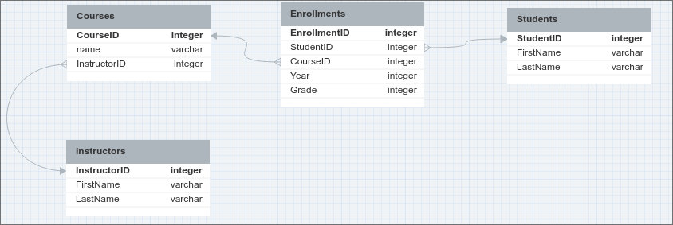

# Databases

**Live demo:** [repository](https://github.com/KlemenVovk/ids-tutoring-s4)

**Solve it yourself homework problem:** TBA after the tutoring session.

## But why? Aren't CSVs/Excel enough?

At first glance, introducing and/or using a database seems like a lot of additional work for achieving what CSV (or any other format) can do without any additional effort.

:::note
This is also the stance of the industry, as a lot of things are stored in Excel to this date. Introducing a database can be very time consuming (after all, there are people who create and manage databases for a living), while basically everyone is expected to know how to use Excel.
:::

Rather than list a bunch of theory on advantages/disadvantages of using a database, I will provide some actionable advice:

### You should use a database if:
- **you have a large amount of data:** CSVs/Excel become increasingly unusable as the amount of data increases (this is especially true if you have lots of formulas in Excel). A rule of thumb is if you can't read all of your data in RAM (e.g. do a single `pd.read_csv()`).
- **speed is crucial:** doing data querying/filtering in SQL/NoSQL is usually orders of magnitude faster than doing it with Pandas etc.
- **your data has complex relationships:** if you have multiple tables connected with each other through 1:1 or 1:N relationships (e.g. products-customers-purchases), dealing with multiple CSV files (writing/retrieving data) is clunky.
- **multiple users need to interact with the data:** passing a CSV file around is NOT the way to go. Especially if multiple users need access at the same time (data conflicts).
- **you need to restrict access (what someone can do with the data)**.
- **you need to scale:** if there may be many requests to the data at the same time.

### You should be fine without a database if:
- **you are the only one that needs access to the data.** You don't need the scalability and granular security that a database offers.
- **your data is mostly read-only**: e.g. reading a dataset for training a model. There is no point in introducing the power of database if you will read everything at once anyway.
- **your data is simple:** more specifically, there are no relationships (i.e. only 1 or 2 tables that aren't really connected).

:::note
As we will discuss below, there are other, nonrelational databases, that don't use SQL for querying (online you might encounter these under the NoSQL umbrella term). Personally, I use the above advice to decide if I need a database or not, and then if I do, I research which database to use for the use case.
:::

:::tip
ALWAYS do scaling with the technology natively provided by the database itself. DO NOT prefer using Kubernetes or anything else as it is way more error prone and clunky. The people that designed the database should also know how to design the best system for scaling/redundancy for that database.
:::

:::tip
Always try to filter/prepare the data as much as possible in SQL, before brining it into your programming language of choice. Ideally, the data returned by SQL should be ready (in the appropriate format) for your application. Doing it later will almost always be way slower and clunkier. SQL is very powerful and fast, use it if you can.
:::

## Types of databases

There are many types of databases, each saving data in its own way and each having its own way for querying/updating (e.g. SQL, Mongo Query Language...). For the sake of brevity let's mention some types and give examples of databases implementing them (these are nor exclusive nor exhaustive):
- Relational databases: organize data into tables with predefined relationships ([MySQL](https://www.mysql.com/), [PostgreSQL](https://www.postgresql.org/), [Oracle](https://www.oracle.com/database/)). You use SQL for interacting with these.
- Non-relational databases: organize data with very flexible structures (e.g. MongoDB uses collections of documents - dictionaries).
- In-memory databases: store data in RAM for ultra-fast access. Remember when we talked about [using Redis for caching](https://klemenvovk.github.io/ids-tutoring/session3#chapter-7-adding-another-container-into-the-mix)?
- Graph databases: store graphs (as in nodes and edges), e.g. Neo4j.
- Time series databases: designed for time series data - logging, IoT, e.g. InfluxDB.
- Vector databases: store vectors (i.e. embeddings of data) and implements querying by distance etc. An example of a vector database is pinecone.

:::tip
While there are many types of databases (with new ones regularly being proposed), for the vast majority of use cases a relational database (e.g. PostgreSQL) is all you need. There are many SQL features that already solve a problem a certain type of database addresses, but tend to get overlooked (i.e. indexing) and then another type of database with less support gets chosen. If you already have a database available, think twice before introducing another, as usually it's easier to have only one database due to maintenance.
:::

For the rest of this session, we will focus only on relational databases, using SQLite as a concrete example as it is easy to setup and work with. Should you need something production-ready and well-supported, a good recommendation is [PostgreSQL](https://www.postgresql.org/), as it has been [the most popular database for a few years in a row now](https://survey.stackoverflow.co/2023/#section-most-popular-technologies-databases).

## Key terminology
- **DBMS** - short for Database management system, this is the software that actually implements the database.
- **Query language** - a language you use for querying/updating the database. We will deal only with SQL, however there are others.
- **Relation** - a concept from [relational algebra](https://en.wikipedia.org/wiki/Relational_algebra) that refers to a set of tuples (rows) that have the same attributes (columns) with defined data types. This is why a table is a natural way to represent a relation, however a table is NOT equivalent to a relation (we can get different relations if we select different subsets of columns in a table). However, you will see "relation" and "table" used interchangeably.
- **Primary key** - a unique value that identifies a row. In a "Employees" table that might be a column of "Employee ID number".
- **Foreign key** - a primary key from another table. I.e. if we have a "Departments" and "Employees" tables, each department may have multiple employees, but each employee is in exactly one department (so N:1 relationship). In the employees table, we would like to know for each employee, in which department they work. Therefore in the "Employees" table we have a primary key "EmployeeNumber" uniquely identifying an employee, and a foreign key "DepartmentID" (which are values from the column "DepartmentID" in the "Departments" table).
- **Normalization** - when designing databases, we often have duplicate/redundant columns/rows between tables. This is problematic as all versions of a column need to be the same (so updated) if we don't want to have data conflicts. Normalization is a process of organizing a database so that we remove these redundancies.
- **Database state** - the data in the database
- **Transaction** - a sequence of one or more operations performed on a database that are treated as a single unit of work.
- **ACID** - short for Atomicity, Consistency, Isolation and Durability. Relational databases guarantee these properties.
  - **Atomicity** - each transaction is treated as a single unit - if any part of it fails, the entire transaction is rolled back, either everything is done or everything is rolled back.
  - **Consistency** - each transaction brings database from a valid state to a valid state.
  - **Isolation** - multiple transactions may be executed concurrently, isolation ensures there is no interference between these transactions. We can control [isolation levels](https://www.postgresql.org/docs/current/transaction-iso.html).
  - **Durability** - once a transaction is committed, its effects are permanent surviving system failures, crashes, power outages...
- **ORM** - Object Relational Mapping is a programming technique that allows developers to interact with a relational databases in a natural, object-oriented way. Concretely, instead of writing raw SQL commands and having nested lists of values in Python, we map each row from a table in a database to an object in our programming language of choice. More about these later.

## SQL

To interface with a relational database (in our case SQLite) we use SQL. Without delving to deep, we divide it into the following subsets:
- **Data Query Language (DQL)** - for retrieving data from the database. e.g. `SELECT * FROM Courses`,
- **Data Manipulation Language (DML)** - for changing/deleting/inserting data into a database, e.g. `INSERT INTO Courses(<columns>) VALUES (<values>)`,
- **Data Definition Language (DDL)** - for defining and managing the structure of a database, e.g. `CREATE TABLE Courses(<columns>)`,
- **Data Control Language (DCL)** - for controlling access/permissions to the database, e.g. `GRANT <privilege> ON <object> TO <user>`,
- **Transaction Control Lanugage (TCL)** - for managing transactions, e.g. `COMMIT` or `ROLLBACK` or `SAVEPOINT`.

As a data scientist you should be proficient mainly with DQL and DML, as this is how you get and save/change data.

:::danger
Different relational DBMS may vary in functionality, always refer to the (SQL) documentation of your specific DBMS (e.g. PostgreSQL)!
:::

### DQL
The only statement you need to know here is `SELECT` and its various clauses for ordering, filtering, etc. Let's take a look at a few examples. You can delve deeper in the [PostgreSQL SELECT documentation](https://www.postgresql.org/docs/current/sql-select.html).

#### Example 1

Consider a products table with the following columns:
- product_id (unique identifier for each product)
- product_name (name of the product)
- category (category to which the product belongs)
- price (price of the product)

We want to get products with belonging to the category 'Electronics' with the original price of at least 100. However, our output should add tax by multiplying the original price by 1.1. Let's iterate to the solution:

We start by selecting everything (all columns) from the products table.

```sql
SELECT 
    *
FROM 
    products
```

:::danger
SELECT selects columns, not rows! Since we haven't done any filtering by row, all rows will be returned, but the * above refers to all columns.
:::

Now let's filter to rows from the category Electronics and price over 100:

```sql
SELECT 
    *
FROM 
    products
WHERE 
    category = 'Electronics'
    AND price > 100
```

Finally, let's compute the price including tax and order decreasingly by price:
```sql
SELECT 
    product_id,
    product_name,
    category,
    price * 1.1 AS price_with_tax -- AS just renames the column
FROM 
    products
WHERE 
    category = 'Electronics'
    AND price > 100
ORDER BY 
    price DESC
```

#### Example 2

Consider a sales table with the following columns:
- order_id (unique identifier for each order)
- product_id (unique identifier for each product)
- quantity (quantity of the product ordered)
- unit_price (unit price of the product)
- customer_id (unique identifier for each customer)
- order_date (date when the order was placed)

Each row is a sale of a certain product. Note that if a customer bought two products at once, that creates two rows with the same order_id and customer_id!

We are interested in getting a sales summary per customer for this year. We want to know how many orders a customer placed, what was the total number of products bought and what was the average unit price. For brevity, let's discard the customers that had less than 10 orders.

Let's iterate to the solution. We start by selecting all rows for this year.
```sql
SELECT
    *
FROM
    sales
WHERE 
    order_date BETWEEN '2022-01-01' AND '2022-12-31'
```

Since we are interested in a per customer summary, we need to group by customers (customer_id).

```sql
SELECT 
    *
FROM 
    sales
WHERE 
    order_date BETWEEN '2022-01-01' AND '2022-12-31'
GROUP BY 
    customer_id
```

Now we need to count how many orders a customer placed (remember there can be multiple rows with the same order_id indicating that the customer bought multiple products at once), we need to know the total number of units ordered and what was the average price.

```sql
SELECT 
    customer_id,
    COUNT(DISTINCT order_id) AS total_orders, -- DISTINCT means unique, as there can be multiple rows with the same order_id
    SUM(quantity) AS total_units_ordered,
    AVG(unit_price) AS average_unit_price, -- Functions like COUNT, SUM, AVG, MIN, MAX are called aggregation functions (remember pandas.groupby().agg()?)
FROM 
    sales
WHERE 
    order_date BETWEEN '2022-01-01' AND '2022-12-31'
GROUP BY 
    customer_id
ORDER BY 
    average_unit_price DESC;
```

Lastly, discard customers with less than 10 orders.

```sql
SELECT 
    customer_id,
    COUNT(DISTINCT order_id) AS total_orders,
    SUM(quantity) AS total_units_ordered,
    AVG(unit_price) AS average_unit_price,
FROM 
    sales
WHERE 
    order_date BETWEEN '2022-01-01' AND '2022-12-31'
GROUP BY 
    customer_id
HAVING 
    total_orders > 50 -- This wouldn't work in the WHERE clause
ORDER BY 
    average_unit_price DESC;
```

:::danger
Notice how WHERE and HAVING clauses seem to do the same thing (filtering), but are separate. This is intentional, HAVING exclusively filters the results of aggregations (so the results of COUNT, SUM, AVG, MIN, MAX...).
:::

#### Working with multiple tables
Up to now we were working with only 1 table. What if we want to join information from multiple tables? This is where joining comes in. Joining means aligning rows from one table to rows from another table by some kind of equivalence.


Credit: [datacamp.com](https://www.datacamp.com/cheat-sheet/sql-joins-cheat-sheet).


#### Example 3
Consider two tables:

orders table:
- order_id (unique identifier for each order)
- customer_id (unique identifier for each customer placing the order - this is a foreign key)
- product_name (name of the product ordered)
- quantity (quantity of the product ordered)
- order_date (date when the order was placed)

customers table:
- customer_id (unique identifier for each customer)
- customer_name (name of the customer)
- email (customer's email address)
- country (customer's country)

Let's get 100 most recent orders and the customers (name, email, country) that placed them.

```sql
SELECT 
    o.order_id,
    o.product_name,
    o.quantity,
    o.order_date,
    c.customer_name,
    c.email,
    c.country
FROM 
    orders o -- we make an alias 'o' so that the query is easier to write
JOIN 
    -- we join orders to customers (inner join) by saying that rows should be joined such that
    -- the customer_id from the orders table is the same as the customer_id from the customer table.
    customers c ON o.customer_id = c.customer_id 
ORDER BY 
    o.order_date DESC
LIMIT 100; -- limit output to 100 rows, since they are sorted, we get 100 most recent orders
```

### DML


## A full example

Instead of dumping a bunch of theory (as you can Google that and there are many resources far better than what I would've written), we will do a full example (from database design to implementation and querying).

### The problem - FRI course registration system
Design a database to manage student enrollments to different courses and their achieved grades. The system should store information about the students, the courses, the instructors as well as student enrollments (and grades).

:::note
Designing databases is hard, and there are jobs/career paths that specialize only in database design/admin, so do not underestimate this task.
:::

### The proposed schema


Drawn with [dbdesigner.net](https://dbdesigner.net). This type of diagram is also referred to as an ERD (Entity Relationship Diagram).

The schema shows 4 tables. Initially, reading the problem definition, one might think we only need 3 tables (Courses, Students, Instructors). However, if we examine the relationship cardinalities:
- Courses-Instructors = N:1 (each course has exactly one instructor, but each instructor may teach multiple courses),
- Courses-Students = N:M (each course can have multiple students, and each student can be enrolled in multiple courses).

Many-to-many relationships (N:M) in relational databases are modeled by introducing a new table C, such that A:C has cardinality 1:M and C:B has cardinality N:1. Conveniently, rows in this intermediary table have a practical meaning (mapping) - enrollments. Also notice how we have already defined the data types - relational databases require such rigorous definitions ahead of time to ensure that all data is in a consistent format later (otherwise the transaction fails).

:::note
Database schema design is much more in depth than what we will show (e.g. notice how the arrows connecting the tables above have different signs on the ends - this is to model the cardinality of the relationship). There are also multiple levels we can model on (logical, physical, conceptual). Should you want to know more, take a look [here](https://en.wikipedia.org/wiki/Entity%E2%80%93relationship_model).
:::


## SQLite

## ORM (Object Relational Mapping)


## General tips